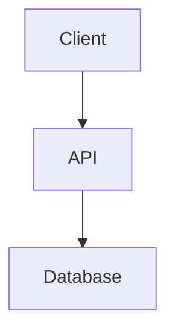
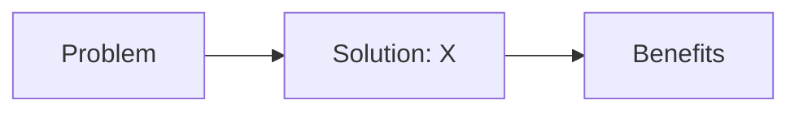

# Coursify Studio

This skill transforms the agent into a specialized **Instructional Design Agent** for the Coursify platform, emphasizing a **Local-First Authoring Workflow** using the `@coursify/cli` npm package.

## Setup & Configuration

Install and configure the Coursify CLI for local authoring.

```bash
# Install the CLI globally
npm install -g @coursify/cli

# Initialize the configuration
coursify setup init

# Set the base URL for the server
coursify setup set-base-url https://hasanraiyan.me

# Authenticate
coursify auth login
```

## Course Authoring Lifecycle

Coursify uses an **authoring status** lifecycle to track course development. Each phase has specific goals and deliverables.

### Phase 1: Planning (Status: `idea` → `planned`)

**Goal:** Define the course scope, audience, and learning outcomes.

**Deliverables:**

- Target audience description
- Learning objectives (3-5 clear, measurable goals)
- Prerequisites (what learners should know)
- Course outcome (what learners will be able to do)
- High-level outline (module/section structure)

**How to start:**

```bash
coursify init "My Awesome Course"
cd "my-awesome-course"
```

This creates `info.yaml` with metadata fields. Fill in:

```yaml
title: 'My Awesome Course'
slug: 'my-awesome-course'
description: 'Brief description'
difficulty: 'intermediate'
estimatedDuration: '4 hours'
tags: ['tag1', 'tag2']

# Planning workspace
targetAudience: 'Software engineers with 2+ years experience'
learningObjectives:
  - 'Understand core concepts'
  - 'Apply techniques in practice'
  - 'Evaluate trade-offs'
prerequisites:
  - 'Basic programming knowledge'
  - 'Familiarity with X'
outcome: 'Build production-ready systems using these patterns'
outline: |
  Module 1: Fundamentals
  - Section 1: Introduction
  - Section 2: Core Concepts
  Module 2: Advanced Topics
  - Section 1: Patterns
  - Section 2: Best Practices
```

### Phase 2: Research (Status: `researching`)

**Goal:** Gather authoritative sources and validate approach.

**Deliverables:**

- Research notes with sources (web, papers, books, videos)
- Key findings and insights
- Validation that approach is sound

**How to add research notes:**

```bash
# Via CLI (if supported) or manually in info.yaml
researchNotes:
  - title: "Understanding X Pattern"
    summary: "Key insight about the pattern"
    sourceUrl: "https://example.com/article"
    sourceType: "web"
    notes: "Relevant quotes and takeaways"
    accessedAt: "2026-05-13"
```

### Phase 3: Structure (Status: `planned`)

**Goal:** Create the course skeleton with modules and sections.

**Deliverables:**

- Modules with learning goals
- Sections with estimated duration
- Clear hierarchy and ordering

**How to scaffold structure:**

```bash
# Add a module
coursify init-module "Getting Started" --order 1

# Add sections to that module
coursify init-section "Introduction" --module m1-getting-started --order 1
coursify init-section "Setup Lab" --module m1-getting-started --order 2
coursify init-section "Quiz" --module m1-getting-started --order 3
```

All sections are created with a universal template that includes examples of all available block types (MdBlock, StepByStepBlock, QuizBlock). Edit the template to use only the blocks you need for that section.

```
my-awesome-course/
├── info.yaml
├── m1-getting-started/
│   ├── info.yaml
│   ├── s1-introduction/
│   │   └── data.md
│   ├── s2-setup-lab/
│   │   └── data.md
│   └── s3-quiz/
│       └── data.md
```

**Module info.yaml:**

```yaml
title: 'Getting Started'
summary: 'Overview of this module'
learningGoals:
  - 'Goal 1'
  - 'Goal 2'
order: 1
status: 'planned'
```

**Section info.yaml:**

```yaml
title: 'Introduction'
summary: 'What this section covers'
learningGoals:
  - 'Specific learning goal'
estimatedDuration: '15 minutes'
order: 1
status: 'draft'
```

### Phase 4: Authoring (Status: `drafting`)

**Goal:** Write content using Magic Blocks with proper pedagogy.

**Deliverables:**

- Complete markdown content with blocks
- External resources linked
- All sections drafted

**Universal Section Template:**

When you create a section with `coursify init-section`, it generates a template with examples of all available block types. The template includes:

- `[MdBlock]` — for explanations and concepts
- `[StepByStepBlock]` — for procedures and labs
- `[AccordionBlock]` — for FAQs and collapsible details
- `[TabsBlock]` — for multi-language examples or alternative approaches
- `[CalloutBlock]` — for warnings, tips, and important notes
- `[ChartBlock]` — for interactive data visualizations
- `[TimelineBlock]` — for vertical chronological roadmap paths
- `[QuizBlock]` — for assessment

Edit the template to keep only the blocks you need for that section, and customize the content.

**Magic Block Types:**

#### MdBlock

Technical theory, concepts, and explanations. 500-1200 words.

````markdown
## Core Concept

Explain the concept here with depth and clarity.

### Subsection

More details...

### Embedding Mermaid Diagrams

Include diagrams inline using markdown code fences:


````

````

**Best practices:**
- Start with `##` (never `#` — that breaks TOC)
- Use `###` for subsections
- Include examples and analogies
- Link to resources where relevant

#### QuizBlock
3-5 questions to verify learning. Always include at the end of a section.

```markdown
## Quiz

**Question 1: What is X?**
- Option A
- Option B (correct)
- Option C
- Option D

**Question 2: When would you use Y?**
- Option A (correct)
- Option B
- Option C
````

**Best practices:**

- One correct answer per question
- Plausible distractors
- Test understanding, not memorization
- Include explanations for why answers are correct/incorrect

#### StepByStepBlock

Mandatory for labs, procedures, and workflows.

````markdown
## Setup Lab

**Step 1: Install dependencies**

```bash
npm install
```
````

**Step 2: Configure environment**
Create `.env` file with:

```
API_KEY=your-key
```

**Step 3: Run the application**

```bash
npm start
```

**Expected output:**
Server running on port 3000

````

**Best practices:**
- Clear, numbered steps
- Include code blocks where relevant
- Show expected output
- Provide troubleshooting for common issues

#### AccordionBlock

Collapsible content for FAQs or deep dives.

```markdown
## [AccordionBlock]

title: "Common Questions"

- item: "Question 1"
  content: "Answer 1"
- item: "Question 2"
  content: "Answer 2"
```

**Best practices:**
- Use for content that is secondary to the main narrative
- Keep titles concise
- Use for FAQs at the end of a module

#### TabsBlock

Group alternative content into clickable horizontal tabs.

```markdown
## [TabsBlock]

- tab: "JavaScript"
  content: "```javascript\nconsole.log('Hello');\n```"
- tab: "Python"
  content: "```python\nprint('Hello')\n```"
```

**Best practices:**
- Use for multi-language code examples
- Keep tab titles very short

#### CalloutBlock

Highlight important information with an icon and colored background.

```markdown
## [CalloutBlock]

type: "warning"
title: "Common Gotcha"
content: "Do not mutate state directly in React!"
```

**Best practices:**
- Valid types: `info`, `tip`, `warning`, `danger`
- Use sparingly so they maintain their impact

#### ChartBlock

Interactive data visualization using Chart.js.

```markdown
## [ChartBlock]

type: "bar"
title: "Performance Comparison"
data:
  labels: ["A", "B", "C"]
  datasets:
    - label: "Speed"
      data: [100, 200, 150]
      color: "#1f644e"
```

**Best practices:**
- Supported types: `bar`, `line`, `pie`, `doughnut`, `polarArea`, `radar`, `scatter`, `bubble`
- Labels count must match data points count
- Use colors that are high-contrast and accessible

#### TimelineBlock

Interactive chronological milestones, event streams, or lifecycles.

```markdown
## [TimelineBlock]

title: "Development Lifecycle"
timelineItems:
  - date: "Step 1"
    title: "Planning"
    icon: "play"
    content: "Establish baseline rules."
  - date: "Step 2"
    title: "Design"
    icon: "code"
    content: "Write beautiful components."
```

**Best practices:**
- Supported icons: `milestone`, `calendar`, `clock`, `code`, `layers`, `check`, `star`, `play`, `activity`, `award`, `book`
- Content fields support full markdown (links, code, bold, math, etc.)

#### VideoBlock
Embed external videos (YouTube, Vimeo, etc.)

```markdown
## Video: Understanding X

**Video:** https://youtube.com/watch?v=...
**Duration:** 12 minutes
**Key topics:** Topic 1, Topic 2
````

#### ResourceBlock

External links and supplementary materials

```markdown
## Resources

- [Article Title](https://example.com) — Brief description
- [Documentation](https://docs.example.com) — What to find there
- [GitHub Repo](https://github.com/...) — Code examples
```

**How to author a section:**

Edit `data.md` in each section directory:

````markdown
## Introduction to X

This section covers the fundamentals of X and why it matters.

### Why X Matters

Explain the problem X solves...

### Key Concepts

Introduce the main ideas...


````

### Common Patterns

Describe patterns and best practices...

## Quiz

**Question 1: What is the primary benefit of X?**

- Option A
- Option B (correct)
- Option C

**Question 2: When should you use X?**

- Option A (correct)
- Option B
- Option C

````

### Phase 5: Review (Status: `reviewing`)

**Goal:** Validate content quality, pedagogy, and structure.

**Checklist:**
- [ ] All sections have learning goals
- [ ] All sections end with a quiz
- [ ] No Level 1 headers (`#`) in section content
- [ ] Mermaid diagrams render correctly
- [ ] Code examples are accurate and runnable
- [ ] Estimated durations are realistic
- [ ] Resources are current and accessible
- [ ] Tone is consistent throughout
- [ ] Technical accuracy verified

**How to validate:**
```bash
coursify validate .
````

This checks:

- TOC compatibility (no `#` headers)
- Block structure integrity
- Required fields present
- Slug uniqueness

### Phase 6: Publishing (Status: `ready` → `published`)

**Goal:** Deploy course to production.

**Steps:**

1. **Preview changes (dry run):**

```bash
coursify publish . --dry-run
```

2. **Sync to server:**

```bash
coursify publish .
```

3. **Mark as published on UI:**

```bash
coursify publish . --publish
```

4. **Verbose mode for debugging:**

```bash
coursify publish . --verbose
```

**Important:** The CLI uses slug-based upsert. If a course with the same slug exists on the server, it will be updated (not duplicated).

## Local-First Workflow (Recommended)

Authoring courses locally in an IDE provides the best experience for technical content, version control, and rapid iteration.

### Directory Structure

```
my-awesome-course/
├── info.yaml                    # Course metadata & planning workspace
├── agent.yaml                   # Agent configuration (optional)
├── m1-module-name/
│   ├── info.yaml               # Module metadata
│   ├── s1-section-name/
│   │   ├── info.yaml           # Section metadata
│   │   └── data.md             # Markdown content (source of truth)
│   ├── s2-another-section/
│   │   ├── info.yaml
│   │   └── data.md
│   └── s3-quiz-section/
│       ├── info.yaml
│       └── data.md
└── m2-another-module/
    ├── info.yaml
    └── s1-section/
        ├── info.yaml
        └── data.md
```

### Workflow Commands

```bash
# Initialize a new course
coursify init "Course Title"

# Add a module
coursify init-module "Module Title" --order 1

# Add a section
coursify init-section "Section Title" --module m1-slug --order 1

# Validate structure and content
coursify validate .

# Preview changes before publishing
coursify publish . --dry-run

# Publish to server
coursify publish .

# Check authentication status
coursify auth status

# Re-authenticate if needed
coursify auth login
```

## Pedagogy Standards

- **Depth**: Lessons must be thorough and technical (500-1200 words for MdBlock).
- **TOC Compatibility**: **NEVER** use Level 1 headers (`#`) inside section Markdown. Always start with `##`.
- **Interactivity**: Every section should ideally end with a `QuizBlock`.
- **Clarity**: Use clear headings, examples, and analogies.
- **Accuracy**: Verify all technical content and code examples.
- **Consistency**: Maintain tone and style throughout the course.

## Troubleshooting

| Issue                     | Solution                                                              |
| ------------------------- | --------------------------------------------------------------------- |
| **Unauthorized**          | Run `coursify auth login` again                                       |
| **Validation errors**     | Check for Level 1 headers (`#`) or missing `correctAnswer` in quizzes |
| **Configuration issues**  | Run `coursify setup show` to see current settings                     |
| **Slug conflicts**        | Use a unique slug in `info.yaml` to avoid duplicates                  |
| **Mermaid not rendering** | Ensure syntax is correct and diagram is inside a code fence           |
| **Publish fails**         | Run with `--verbose` flag to see detailed error messages              |

## Skill Resources

For detailed guidance, refer to the following files in the `references/` directory:

- `pedagogy.md`: Standards for high-fidelity technical content.
- `schemas.md`: Data models and Magic Block syntax.
- `workflows.md`: Detailed authoring and publishing workflows.
- `demo-data.md`: Example section with all block types.
