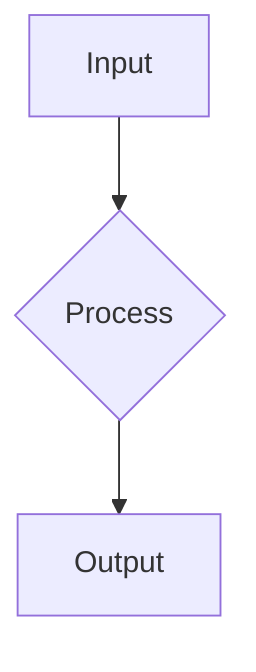

# Instructional Design & Pedagogy

To build high-fidelity technical courses, move beyond "writing information" and focus on "designing learning."

## The Quality Bar

- **Section Depth**: A standard lesson should have roughly **500-1200 words** of text content. Never settle for superficial summaries.
- **TOC Rendering**: Always use `##` for primary headings and `###` for sub-headings within `MdBlock` to ensure the Table of Contents parses correctly.
- **Procedural Logic**: ALL instructions involving multiple steps (installations, code walkthroughs, workflows) **MUST** use the `StepByStepBlock`.
- **Architectural Visualization**: Use ` ```mermaid ``` ` graphs embedded in MdBlock to explain complex data flows or system architectures. Place these EARLY in the section to provide a "mental map."
- **Math**: Use LaTeX syntax ($...$ for inline, $$...$$ for display).
- **Interactivity**: Every section should end with a `QuizBlock` to verify learning.

---

## Phase 1: Planning — Define Learning Outcomes

Before writing a single section, establish clear learning objectives.

### Learning Objectives Framework

Use the **SMART** framework:

- **Specific**: What exactly will learners be able to do?
- **Measurable**: How will you verify they learned it?
- **Achievable**: Is this realistic for the target audience?
- **Relevant**: Does this align with the course goal?
- **Time-bound**: How long should this take?

### Example Learning Objectives

❌ **Weak**: "Understand databases"
✅ **Strong**: "Design a normalized relational schema for a multi-tenant SaaS application"

❌ **Weak**: "Learn about APIs"
✅ **Strong**: "Implement a RESTful API with proper error handling and authentication"

### Target Audience Definition

Be specific about who you're teaching:

- **Experience Level**: Years of experience, prior knowledge
- **Role**: Backend engineer, data scientist, DevOps, etc.
- **Context**: What problem are they trying to solve?
- **Constraints**: Time available, tools available, learning style

---

## Phase 2: Research — Validate Your Approach

Document your sources and validate that your approach is sound.

### Research Note Template

```yaml
researchNotes:
  - title: 'Understanding X Pattern'
    summary: 'Key insight about the pattern and why it matters'
    sourceUrl: 'https://example.com/article'
    sourceType: 'web' # web, paper, book, video, other
    notes: |
      - Key quote 1
      - Key quote 2
      - How this relates to our course
    accessedAt: '2026-05-13'
```

### What to Research

1. **Authoritative Sources**: Academic papers, official documentation, industry standards
2. **Real-World Examples**: How is this used in production?
3. **Common Pitfalls**: What mistakes do people make?
4. **Evolution**: Has this changed recently? Are there deprecated approaches?
5. **Alternatives**: What are competing approaches and why did you choose this one?

---

## Phase 3: Structure — Organize Content Hierarchy

Create a clear module and section structure that builds knowledge progressively.

### Module Design

Each module should:

- Have 3-5 sections (not too granular, not too broad)
- Build on previous modules
- Have clear learning goals
- Take 1-2 hours to complete

### Section Design

Each section should:

- Focus on ONE core concept
- Take 15-30 minutes to complete
- Have 500-1200 words of content
- End with a quiz
- Include at least one visual (diagram, code example, or video)

### Knowledge Progression

Structure sections to build understanding progressively:

```
Foundation (What is it?)
    ↓
Context (Why does it matter?)
    ↓
Application (How do I use it?)
    ↓
Mastery (How do I optimize it?)
```

---

## Phase 4: Authoring — The "Concept-Context-Check" Framework

Every section should follow this instructional cycle:

### 1. Concept (MdBlock)

Introduce the technical definition or logic.

**Best practices:**

- Start with `##` for the main heading
- Use `###` for subsections
- Define key terms clearly
- Provide context for why this matters

**Example:**

```markdown
## Understanding Normalization

Database normalization is the process of organizing data to reduce redundancy and improve data integrity. It involves breaking down a large table into smaller, related tables.

### Why Normalization Matters

Without normalization, you might have:

- Data duplication (wasting storage)
- Update anomalies (inconsistent data)
- Insertion anomalies (can't add data without other data)
```

### 2. Context (StepByStepBlock or VideoBlock)

Show the concept in action.

**Best practices:**

- Use StepByStepBlock for procedures and workflows
- Use VideoBlock for demonstrations
- Include code examples or diagrams
- Show real-world scenarios

**Example:**

```markdown
## [StepByStepBlock]

title: "Normalizing a Database Schema"
showNumbering: true

- step: "Identify Repeating Groups"
  content: "Look for columns that contain multiple values for a single record."
- step: "Create Separate Tables"
  content: "Move repeating groups to new tables with foreign keys."
- step: "Verify Relationships"
  content: "Ensure all relationships are properly defined."
```

### 3. Check (QuizBlock)

Validate understanding immediately.

**Best practices:**

- 3-5 questions per quiz
- Test understanding, not memorization
- Include detailed explanations
- Use plausible distractors

**Example:**

```markdown
## [QuizBlock]

- question: "What is the primary goal of database normalization?"
  options:
  - "To make queries faster"
  - "To reduce data redundancy and improve data integrity"
  - "To increase storage capacity"
  - "To simplify SQL syntax"
    correctAnswer: "To reduce data redundancy and improve data integrity"
    explanation: "Normalization eliminates duplicate data and ensures consistency. While it can sometimes slow queries, that's a trade-off for data integrity."
```

---

## The "Standardized Section Flow"

A premium section follows this mandatory template:

````markdown
## [MdBlock]

## Primary Concept Title

High-level introduction to the core concept.


````

### Detailed Sub-topic

In-depth technical explanation of a specific aspect.

### Example

Include a realistic example, case study, or scenario.

### Practice

Give the learner a small exercise or lab task.

### Common Mistakes

Call out likely misunderstandings and anti-patterns.

### Recap

Summarize in 3-5 crisp bullets.

---

## [StepByStepBlock]

title: "Process or Setup Name"
showNumbering: true

- step: "Step Title"
  content: "Detailed explanation of the step."

---

## [QuizBlock]

- question: "What is X?"
  options: ["Option A", "Option B", "Option C"]
  correctAnswer: "Option B"
  explanation: "Explanation of why this is correct and why others are wrong."

---

## [ResourceBlock]

url: https://example.com/docs
title: "Official Documentation"
type: "doc"

````

---

## High-Fidelity Quiz Design

### Literal Answer Mapping

For `correctAnswer`, use the **exact literal text** of the option. This is mandatory for the parser.

```yaml
correctAnswer: "To reduce data redundancy and improve data integrity"
````

### Explanatory Feedback

Every `correctAnswer` MUST have a detailed `explanation` that:

- Reinforces the "Why"
- Provides immediate pedagogical value
- Explains why other options are incorrect (optional but recommended)

### Question Types

**Conceptual Understanding:**

```
Question: "What is the primary purpose of X?"
Options: [definition A, definition B, definition C, definition D]
```

**Application:**

```
Question: "When would you use X instead of Y?"
Options: [scenario A, scenario B, scenario C, scenario D]
```

**Analysis:**

```
Question: "What would happen if you did X without Y?"
Options: [consequence A, consequence B, consequence C, consequence D]
```

---

## Phase 5: Review — Quality Assurance

Before publishing, validate:

### Content Quality

- [ ] All sections have learning goals
- [ ] All sections end with a quiz
- [ ] No Level 1 headers (`#`) in section content
- [ ] Mermaid diagrams render correctly
- [ ] Code examples are accurate and runnable
- [ ] Estimated durations are realistic

### Pedagogy

- [ ] Learning objectives are SMART
- [ ] Each section follows Concept-Context-Check
- [ ] Tone is consistent throughout
- [ ] Technical accuracy verified
- [ ] Examples are relevant and realistic

### Structure

- [ ] Modules build on each other
- [ ] Sections are appropriately sized
- [ ] Resources are current and accessible
- [ ] No broken links or references

---

## Phase 6: Publishing — Deploy to Production

Once validated, publish your course:

```bash
# Preview changes
coursify publish . --dry-run

# Sync to server
coursify publish .

# Mark as published
coursify publish . --publish
```

---

## Tips for High-Fidelity Content

1. **Write for Your Audience**: Use language and examples they understand
2. **Show, Don't Tell**: Use diagrams, code, and examples liberally
3. **Be Specific**: Avoid vague language like "basically" or "kind of"
4. **Anticipate Questions**: Address common misconceptions proactively
5. **Test Everything**: Verify all code examples work
6. **Use Consistent Terminology**: Define terms once, use them consistently
7. **Break It Down**: Complex concepts should span multiple sections
8. **Provide Context**: Explain the "why" before the "how"
9. **Encourage Practice**: Include exercises and labs
10. **Iterate**: Get feedback and improve based on learner responses
