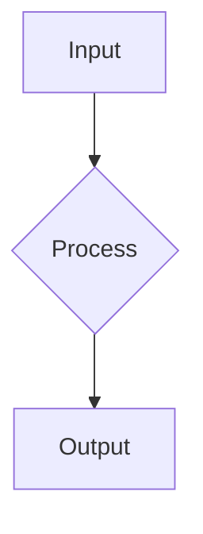

# Instructional Design & Pedagogy

To build high-fidelity technical courses, the agent must move beyond "writing information" and focus on "designing learning."

## The Quality Bar

- **Section Depth**: A standard lesson should have roughly **500-1200 words** of text content. Never settle for superficial summaries.
- **TOC Rendering**: Always use `##` for primary headings and `###` for sub-headings within `MdBlock` to ensure the Table of Contents parses correctly.
- **Procedural Logic**: ALL instructions involving multiple steps (installations, code walkthroughs, workflows) **MUST** use the `StepByStepBlock`.
- **Architectural Visualization**: Use ` ```mermaid ` graphs to explain complex data flows or system architectures. Place these EARLY in the section to provide a "mental map."
- **Math**: Use LaTeX syntax ($...$ for inline, $$...$$ for display).

## The "Standardized Section Flow"

A premium section should follow this **mandatory** Markdown template:

````markdown
## [MdBlock]

## [Primary Concept Title]

High-level introduction to the core concept.


````

### [Detailed Sub-topic]

In-depth technical explanation of a specific aspect of the concept.

---

## [StepByStepBlock]

title: "[Process or Setup Name]"
showNumbering: true

- step: "[Step Title]"
  content: "Detailed explanation of the step. Use \\n\\n for newlines."

---

## [MdBlock]

## Example

Include a realistic example, case study, or scenario that demonstrates the concept in a practical context.

## Practice

Give the learner a small exercise, lab task, or reflection question to apply what they've learned.

## Common Mistakes

Call out likely misunderstandings, "gotchas," or anti-patterns and explain how to avoid them.

## Recap

Summarize the section in 3-5 crisp bullets to reinforce the key takeaways.

---

## [QuizBlock]

- question: "..."
  options: ["...", "..."]
  correctAnswer: "..." (Literal text matching the option)

```

## The "Concept-Context-Check" Framework

Every block sequence in a section should follow this instructional cycle:

1.  **Concept**: Introduce the technical definition or logic (usually an `MdBlock`). Always use `##` for the main heading of the block.
2.  **Context**: Show the concept in action using a `StepByStepBlock` (procedural) or `VideoBlock` (demo).
3.  **Check**: Immediately validate understanding with a 1-2 question `QuizBlock`.

## High-Fidelity Quiz Design

- **Literal Mapping**: For `correctAnswer`, use the **exact literal text** of the option. This is mandatory for the Magic Import parser.
- **Explanatory Feedback**: Every `correctAnswer` MUST have a detailed `explanation` that reinforces the "Why" and provides immediate pedagogical value.
```
