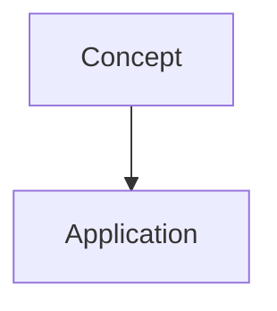

# Instructional Design & Pedagogy

To build high-fidelity technical courses, the agent must move beyond "writing information" and focus on "designing learning."

## The Quality Bar

- **Section Depth**: A standard lesson should have roughly **500-1200 words** of text content. Never settle for superficial summaries.
- **TOC Rendering**: Always use `##` for primary headings and `###` for sub-headings within `MdBlock` to ensure the Table of Contents parses correctly.
- **Procedural Logic**: ALL instructions involving multiple steps (installations, code walkthroughs, workflows) **MUST** use the `StepByStepBlock`.
- **Visuals**: Use ```mermaid for ALL visuals. Always wrap them in a standard code block within an `MdBlock`.
- **Math**: Use LaTeX syntax ($...$ for inline, $$...$$ for display).

## The "Standardized Section Flow"

A premium section should follow this **mandatory** Markdown template:

````markdown
## [MdBlock]

## [Concept Title]

High-level introduction to the concept.


````

### [Sub-topic]

Detailed technical explanation.

---

## [StepByStepBlock]

title: "[Step-by-Step Title]"
showNumbering: true

- step: "[Task Name]"
  content: "Detailed explanation of the step. Use \\n\\n for newlines."

---

## [MdBlock]

## Example

Include a realistic example, case study, or scenario.

## Practice

Give the learner a small exercise, lab task, or reflection question.

## Common Mistakes

Call out likely misunderstandings and how to avoid them.

## Recap

Summarize the section in 3-5 crisp bullets.

---

## [QuizBlock]

- question: "..."
  options: ["...", "..."]
  correctAnswer: "..." (Literal text matching the option)

````

## The "Concept-Context-Check" Framework

Every block sequence in a section should follow this instructional cycle:

1.  **Concept**: Introduce the technical definition or logic (usually an `MdBlock`). Always use `##` for the main heading of the block.
2.  **Context**: Show the concept in action using a `StepByStepBlock` (procedural) or `VideoBlock` (demo).
3.  **Check**: Immediately validate understanding with a 1-2 question `QuizBlock`.

## Visual-First Instruction

Human brains process visuals 60,000x faster than text.

- **Diagram Placement**: Never put a complex diagram at the end. Use it early to provide a "mental map" of the topic.
- **Implementation**: Always wrap diagrams in ```mermaid tags within an `MdBlock`.

## High-Fidelity Quiz Design

Quizzes are for learning, not just testing.

- **Literal Mapping**: For `correctAnswer`, use the **exact literal text** of the option. This is mandatory for the Magic Import parser.
- **Explanatory Feedback**: Every `correctAnswer` MUST have a detailed `explanation` that reinforces the "Why."
````
