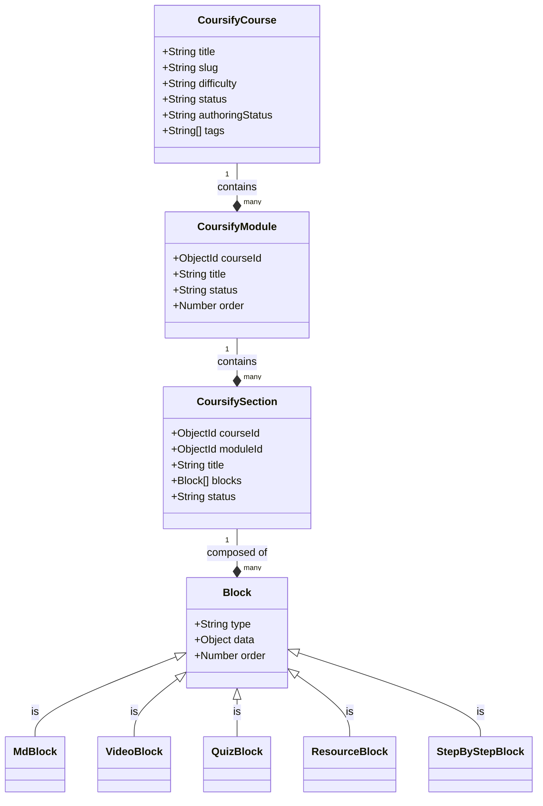

# Coursify Data Models & Schemas



## CoursifyCourse

The top-level entity representing an entire course.

```javascript
{
  title: String,
  slug: String (Unique),
  description: String,
  thumbnail: String (URL),
  difficulty: ['beginner', 'intermediate', 'advanced'],
  status: ['draft', 'published'],
  authoringStatus: ['idea', 'researching', 'drafting', 'reviewing', 'complete'],
  tags: [String],
  estimatedDuration: String
}
```

## CoursifyModule

Groups multiple sections within a course.

```javascript
{
  courseId: ObjectId (ref: CoursifyCourse),
  title: String,
  summary: String,
  order: Number,
  status: ['planned', 'drafting', 'complete', 'needs_review']
}
```

## CoursifySection

The actual learning unit containing content blocks.

```javascript
{
  courseId: ObjectId,
  moduleId: ObjectId (Optional),
  title: String,
  summary: String,
  learningGoals: [String],
  estimatedDuration: String,
  order: Number,
  status: ['planned', 'draft', 'needs_review', 'complete'],
  blocks: [BlockSchema]
}
```

### Block Types

- **MdBlock**: Markdown content `{ type: 'MdBlock', content: String }`
- **VideoBlock**: Embedded video `{ type: 'VideoBlock', video: { url: String, title: String, platform: 'youtube'|'gdrive' } }`
- **QuizBlock**: Assessment `{ type: 'QuizBlock', quiz: { questions: [QuizQuestionSchema] } }`
- **ResourceBlock**: External links `{ type: 'ResourceBlock', resource: { url: String, title: String, type: 'video'|'article'|'doc' } }`
- **StepByStepBlock**: Procedural content `{ type: 'StepByStepBlock', steps: [{ title: String, content: String }] }`
  - _Note: `content` in steps supports full Markdown._
