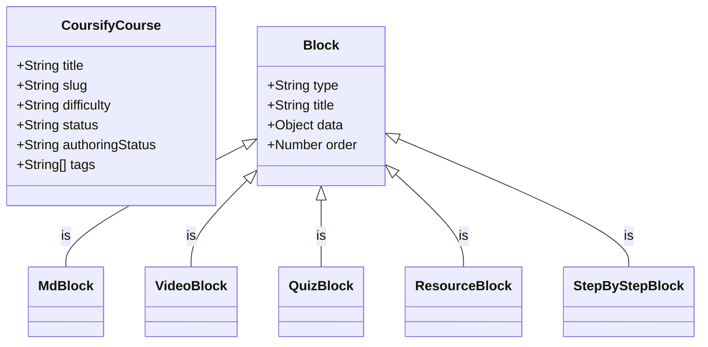

# Coursify Data Models & Schemas

## Block Types (High-Fidelity)

- **MdBlock**: Standard Markdown.
  - `{ type: 'MdBlock', content: String }`
  - **TOC Requirement**: Use `##` for block title to ensure it appears in Table of Contents.
- **StepByStepBlock**: Animated procedural timeline. **Mandatory for all tutorials/setups.**
  - `{ type: 'StepByStepBlock', title: String, showNumbering: Boolean, steps: [{ title: String, content: String }] }`
  - _Note: Use literal `\n\n` within step content strings for correct Markdown rendering inside the card._
- **QuizBlock**: Interactive assessment.
  - `{ type: 'QuizBlock', title: String, quiz: { questions: [QuizQuestionSchema] } }`
  - **Requirement**: `correctAnswer` must be the EXACT literal text of the chosen option string.
- **VideoBlock**: Embedded YouTube content.
  - `{ type: 'VideoBlock', video: { url: String, title: String, platform: 'youtube' } }`
- **ResourceBlock**: High-authority external links.
  - `{ type: 'ResourceBlock', resource: { url: String, title: String, type: 'video'|'article'|'doc' } }`

## Magic Import Parser (Markdown Rules)

To author sections as a single string, follow these header rules:

1.  **Start every block** with a `## [BlockType]` header.
2.  **MdBlock**: Follow the header with standard Markdown. All `#` level headings inside will be converted to TOC items.
3.  **StepByStepBlock**:
    - Use `title: "..."` and `showNumbering: true/false`.
    - Use `- step: "Title"` followed by `content: "..."`.
4.  **QuizBlock**:
    - Use `- question: "..."`
    - Use `options: ["A", "B"]`
    - Use `correctAnswer: "A"`
    - Use `explanation: "..."`
