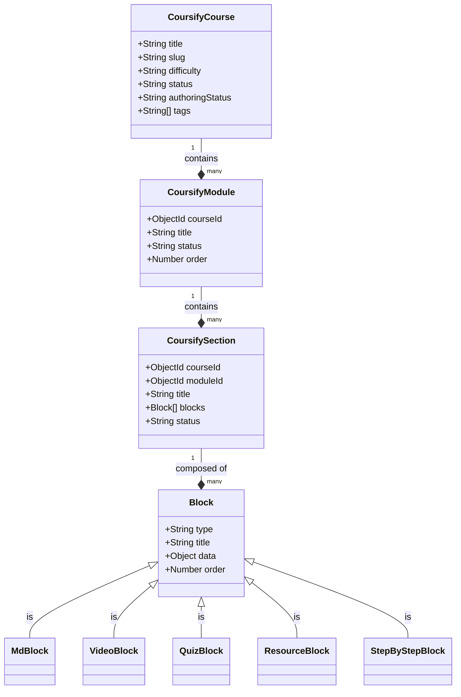

# Coursify Data Models & Schemas



## CoursifySection

The actual learning unit containing content blocks.

```javascript
{
  courseId: ObjectId,
  moduleId: ObjectId (Optional),
  title: String,
  summary: String,
  learningGoals: [String],
  estimatedDuration: String,
  order: Number,
  status: ['planned', 'draft', 'needs_review', 'complete'],
  blocks: [BlockSchema]
}
```

### Block Types (High-Fidelity)

- **MdBlock**: Markdown content.
  - `{ type: 'MdBlock', content: String }`
- **VideoBlock**: Embedded video.
  - `{ type: 'VideoBlock', video: { url: String, title: String, platform: 'youtube' } }`
- **QuizBlock**: Interactive assessment. Supports literal answer text mapping.
  - `{ type: 'QuizBlock', title: String, quiz: { questions: [QuizQuestionSchema] } }`
- **ResourceBlock**: External high-authority links.
  - `{ type: 'ResourceBlock', resource: { url: String, title: String, type: 'video'|'article'|'doc' } }`
- **StepByStepBlock**: Procedural timelines with numbering control.
  - `{ type: 'StepByStepBlock', title: String, showNumbering: Boolean, steps: [{ title: String, content: String }] }`
  - _Note: Use literal `\n\n` within step content strings to represent newlines for correct Markdown rendering._
