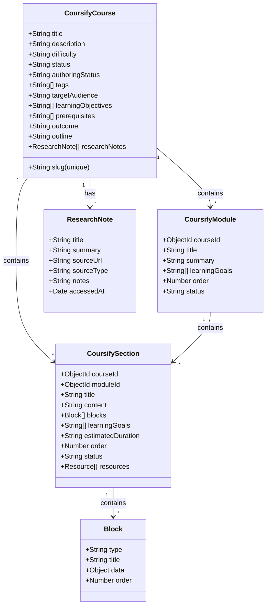
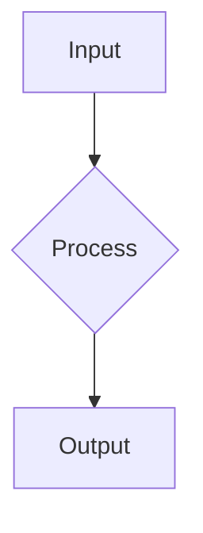

# Coursify Data Models & Schemas

## Data Model Hierarchy



---

## CoursifyCourse Schema

The root course object with planning workspace and authoring lifecycle.

### Core Fields

| Field               | Type     | Required     | Description                            |
| ------------------- | -------- | ------------ | -------------------------------------- |
| `title`             | String   | Yes          | Course title                           |
| `slug`              | String   | Yes (unique) | URL-friendly identifier                |
| `description`       | String   | No           | Brief course description               |
| `difficulty`        | Enum     | No           | `beginner`, `intermediate`, `advanced` |
| `status`            | Enum     | No           | `draft`, `published`                   |
| `tags`              | String[] | No           | Topic tags for discovery               |
| `estimatedDuration` | String   | No           | e.g., "4 hours", "2 weeks"             |
| `thumbnail`         | String   | No           | Course thumbnail image URL             |

### Planning Workspace Fields

These fields support the planning phase (Phase 1) of course authoring:

| Field                | Type     | Description                                        |
| -------------------- | -------- | -------------------------------------------------- |
| `targetAudience`     | String   | Description of who this course is for              |
| `learningObjectives` | String[] | 3-5 SMART learning objectives                      |
| `prerequisites`      | String[] | What learners should know before starting          |
| `outcome`            | String   | What learners will be able to do after completing  |
| `outline`            | String   | High-level course structure (modules and sections) |
| `planningNotes`      | String   | Internal notes during planning phase               |
| `agentNotes`         | String   | Notes from AI agents during authoring              |

### Research Phase Fields

| Field           | Type           | Description                            |
| --------------- | -------------- | -------------------------------------- |
| `researchNotes` | ResearchNote[] | Array of research sources and findings |

### Authoring Lifecycle

| Field             | Type | Values                                                                          | Description                         |
| ----------------- | ---- | ------------------------------------------------------------------------------- | ----------------------------------- |
| `authoringStatus` | Enum | `idea`, `researching`, `planned`, `drafting`, `reviewing`, `ready`, `published` | Current phase of course development |

### Soft-Delete Fields

| Field         | Type   | Description                                          |
| ------------- | ------ | ---------------------------------------------------- |
| `deletedAt`   | Date   | Null = active, Date = soft-deleted                   |
| `syncVersion` | Number | Incremented on each mutation for conflict resolution |

### Example `info.yaml`

```yaml
title: 'Advanced Database Design'
slug: 'advanced-database-design'
description: 'Master normalization, indexing, and optimization techniques'
difficulty: 'advanced'
status: 'draft'
tags: ['databases', 'sql', 'performance']
estimatedDuration: '6 hours'

# Planning Workspace
targetAudience: 'Backend engineers with 3+ years experience'
learningObjectives:
  - 'Design normalized schemas for complex domains'
  - 'Optimize queries using indexes and query plans'
  - 'Evaluate trade-offs between normalization and denormalization'
prerequisites:
  - 'SQL fundamentals'
  - 'Understanding of relational algebra'
outcome: 'Build production-grade database schemas that scale'
outline: |
  Module 1: Normalization Deep Dive
  - Section 1: Normal Forms (1NF through BCNF)
  - Section 2: Denormalization Strategies
  Module 2: Performance Optimization
  - Section 1: Indexing Strategies
  - Section 2: Query Optimization
planningNotes: 'Focus on PostgreSQL examples'
agentNotes: 'Research papers on query optimization added'

# Research Phase
researchNotes:
  - title: 'PostgreSQL Query Planner'
    summary: 'Understanding how PostgreSQL optimizes queries'
    sourceUrl: 'https://www.postgresql.org/docs/current/planner.html'
    sourceType: 'doc'
    notes: 'Key insight: EXPLAIN ANALYZE is essential for optimization'
    accessedAt: '2026-05-13'
```

---

## CoursifyModule Schema

Organizes sections into logical groups within a course.

| Field           | Type     | Required | Description                                       |
| --------------- | -------- | -------- | ------------------------------------------------- |
| `courseId`      | ObjectId | Yes      | Reference to parent course                        |
| `title`         | String   | Yes      | Module title                                      |
| `summary`       | String   | No       | Brief module description                          |
| `learningGoals` | String[] | No       | Module-level learning goals                       |
| `order`         | Number   | No       | Display order within course                       |
| `status`        | Enum     | No       | `planned`, `drafting`, `complete`, `needs_review` |
| `deletedAt`     | Date     | No       | Soft-delete marker                                |
| `syncVersion`   | Number   | No       | Conflict resolution version                       |

### Example `info.yaml`

```yaml
title: 'Normalization Deep Dive'
summary: 'Master database normalization from 1NF to BCNF'
learningGoals:
  - 'Understand the purpose of each normal form'
  - 'Apply normalization to real-world schemas'
  - 'Recognize when to denormalize for performance'
order: 1
status: 'planned'
```

---

## CoursifySection Schema

Individual lessons with markdown-first architecture.

### Core Fields

| Field               | Type     | Required | Description                                    |
| ------------------- | -------- | -------- | ---------------------------------------------- |
| `courseId`          | ObjectId | Yes      | Reference to parent course                     |
| `moduleId`          | ObjectId | No       | Reference to parent module                     |
| `title`             | String   | Yes      | Section title                                  |
| `order`             | Number   | No       | Display order within module                    |
| `status`            | Enum     | No       | `planned`, `draft`, `needs_review`, `complete` |
| `summary`           | String   | No       | Brief section description                      |
| `learningGoals`     | String[] | No       | Section-level learning goals                   |
| `estimatedDuration` | String   | No       | e.g., "15 minutes", "1 hour"                   |

### Markdown-First Architecture

| Field     | Type    | Description                                                     |
| --------- | ------- | --------------------------------------------------------------- |
| `content` | String  | **Source of truth**: Raw Markdown with Magic Blocks             |
| `blocks`  | Block[] | **Processed**: Array of parsed blocks for specialized rendering |

**Important:** The `content` field is the authoritative source. The `blocks` array is derived from it and used by the frontend for rendering.

### Additional Fields

| Field         | Type       | Description                                |
| ------------- | ---------- | ------------------------------------------ |
| `resources`   | Resource[] | External links and supplementary materials |
| `deletedAt`   | Date       | Soft-delete marker                         |
| `syncVersion` | Number     | Conflict resolution version                |

### Example `info.yaml`

```yaml
title: 'First Normal Form (1NF)'
summary: 'Eliminate repeating groups and ensure atomic values'
learningGoals:
  - 'Identify repeating groups in unnormalized data'
  - 'Convert to 1NF by creating separate tables'
  - 'Understand the benefits of 1NF'
estimatedDuration: '20 minutes'
order: 1
status: 'draft'
```

---

## Block Types (Magic Blocks)

All blocks are embedded in the `content` field using Markdown headers.

### MdBlock

Standard Markdown for theory, concepts, and explanations.

````markdown
## [MdBlock]

## Primary Concept Title

Explanation with depth (500-1200 words).

### Subsection

More details...


````

````

**Schema:**
```json
{
  "type": "MdBlock",
  "title": "Primary Concept Title",
  "content": "Raw Markdown content"
}
````

**Requirements:**

- Use `##` for block title (appears in TOC)
- Use `###` for subsections
- Embed Mermaid diagrams using ` ```mermaid ``` ` code fences
- 500-1200 words for standard sections

---

### StepByStepBlock

Animated procedural timeline for tutorials and workflows.

```markdown
## [StepByStepBlock]

title: "Process or Setup Name"
showNumbering: true

- step: "Step Title"
  content: "Detailed explanation of the step."
- step: "Another Step"
  content: "More details..."
```

**Schema:**

```json
{
  "type": "StepByStepBlock",
  "title": "Process Name",
  "showNumbering": true,
  "steps": [
    {
      "title": "Step Title",
      "content": "Detailed explanation"
    }
  ]
}
```

**Requirements:**

- Use `title:` for the block heading
- Use `showNumbering: true` for strict sequences
- Use `showNumbering: false` for iterative/parallel phases
- Use `\n\n` for literal newlines within step content

**When to use:**

- Installation and setup procedures
- Protocol handshakes and state transitions
- Hardware assembly and configuration
- Data flow and system architecture walkthroughs

---

### QuizBlock

Interactive assessment with multiple-choice questions.

```markdown
## [QuizBlock]

- question: "What is X?"
  options:
  - "Option A"
  - "Option B"
  - "Option C"
    correctAnswer: "Option B"
    explanation: "Explanation of why this is correct."
```

**Schema:**

```json
{
  "type": "QuizBlock",
  "title": "Section Quiz",
  "quiz": {
    "questions": [
      {
        "question": "What is X?",
        "options": ["Option A", "Option B", "Option C"],
        "correctAnswer": "Option B",
        "explanation": "Why this is correct..."
      }
    ]
  }
}
```

**Requirements:**

- 3-5 questions per quiz
- `correctAnswer` must be **exact literal text** of an option
- Include detailed `explanation` for each answer
- Test understanding, not memorization
- Use plausible distractors

**Best practices:**

- Always end sections with a quiz
- Include explanations for why other options are incorrect
- Test application and analysis, not just recall

---

### VideoBlock

Embedded external videos (YouTube, Vimeo, etc.)

```markdown
## [VideoBlock]

url: https://youtube.com/watch?v=...
title: "Video Title"
platform: "youtube"
```

**Schema:**

```json
{
  "type": "VideoBlock",
  "video": {
    "url": "https://youtube.com/watch?v=...",
    "title": "Video Title",
    "platform": "youtube"
  }
}
```

**Supported platforms:**

- `youtube`
- `vimeo`

---

### ResourceBlock

External links and supplementary materials.

```markdown
## [ResourceBlock]

url: https://example.com/docs
title: "Official Documentation"
type: "doc"
```

**Schema:**

```json
{
  "type": "ResourceBlock",
  "resource": {
    "url": "https://example.com/docs",
    "title": "Official Documentation",
    "type": "doc"
  }
}
```

**Resource types:**

- `doc` — Official documentation
- `article` — Blog post or article
- `video` — Video tutorial
- `code` — GitHub repository or code example
- `paper` — Academic paper

---

## ResearchNote Schema

Tracks sources and findings during the research phase.

| Field        | Type   | Description                              |
| ------------ | ------ | ---------------------------------------- |
| `title`      | String | Title of the research source             |
| `summary`    | String | Key insight or summary                   |
| `sourceUrl`  | String | URL to the source                        |
| `sourceType` | Enum   | `web`, `paper`, `book`, `video`, `other` |
| `notes`      | String | Detailed notes and quotes                |
| `accessedAt` | Date   | When the source was accessed             |

### Example

```yaml
researchNotes:
  - title: 'Understanding Query Optimization'
    summary: 'How PostgreSQL uses indexes and query plans'
    sourceUrl: 'https://www.postgresql.org/docs/current/planner.html'
    sourceType: 'doc'
    notes: |
      - EXPLAIN ANALYZE shows actual execution time
      - Index selection is automatic in most cases
      - Sequential scans are sometimes faster than index scans
    accessedAt: '2026-05-13'
```

---

## Soft-Delete Pattern

All models use soft-delete via `deletedAt` field:

- `deletedAt: null` — Record is active
- `deletedAt: Date` — Record is deleted (but preserved in DB)

**Important:** Always filter `{ deletedAt: null }` when querying for active records.

---

## Sync Version Field

All models track `syncVersion` for conflict resolution:

- Incremented on each mutation
- Used to detect concurrent edits
- Helps prevent data loss in distributed scenarios

---

## Magic Import Parser Rules

When authoring sections as Markdown, follow these rules:

1. **Start every block** with a `## [BlockType]` header
2. **MdBlock**: Follow the header with standard Markdown
3. **StepByStepBlock**: Use `title:` and `showNumbering:` configuration
4. **QuizBlock**: Use `question:`, `options:`, `correctAnswer:`, `explanation:`
5. **VideoBlock**: Use `url:`, `title:`, `platform:`
6. **ResourceBlock**: Use `url:`, `title:`, `type:`

**Example:**

```markdown
## [MdBlock]

## Introduction to Normalization

Explanation here...

---

## [StepByStepBlock]

title: "Normalizing a Schema"
showNumbering: true

- step: "Identify Repeating Groups"
  content: "Look for columns with multiple values..."

---

## [QuizBlock]

- question: "What is 1NF?"
  options: ["Definition A", "Definition B"]
  correctAnswer: "Definition A"
  explanation: "Because..."
```
