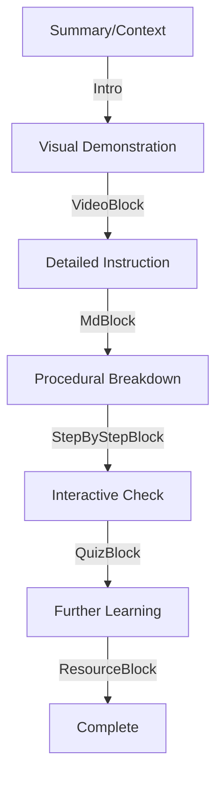

# Coursify Authoring Workflows

## High-Quality Section Design

A premium section should follow this pedagogical flow:

1. **Context**: A short, engaging summary.
2. **Visual**: A `VideoBlock` (if available).
3. **Core Content**: 1-3 `MdBlock`s with clear headings, bold terms, and clean formatting.
4. **Procedural Flow**: A `StepByStepBlock` if the topic involves a sequence (e.g., "The Life of a Packet" or "3-Way Handshake").
5. **Assessment**: A `QuizBlock` with 3-5 challenging questions.
6. **Resources**: A `ResourceBlock` for further reading.

## Procedural Tutorials with StepByStepBlock

Avoid using long numbered lists in `MdBlock` for complex procedures. Instead, use the `StepByStepBlock`:

- **Why**: It provides a high-signal vertical timeline UI that clearly separates phases and reduces cognitive load.
- **When**: Use for protocol state transitions, installation guides, data path tracking, or project timelines.
- **How**: Ensure each step is atomic. Use the `title` for the "What" and the `content` (Markdown supported) for the "How/Why".

## Publication Logic (Strict)

1. **Hierarchical Visibility**:
   - A Section is ONLY visible if its `status` is `complete` AND its parent Module's `status` is `complete` AND the Course `status` is `published`.
2. **Metadata Accuracy**:
   - Section/Module counts on the homepage only include items that meet the visibility criteria above.

## Search Optimization

- Always use `tags` on the Course model for better discoverability.
- Use `learningGoals` in Sections to help the AI Tutor find relevant content.
