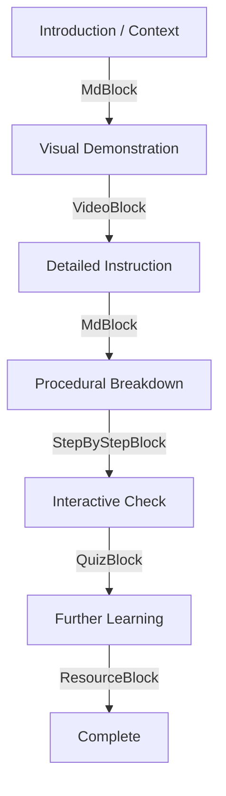

# Coursify Authoring Workflows

## High-Quality Section Design

A premium section should follow this pedagogical flow:



1. **Instructional Context**: Use a short, engaging summary or a diagram within an `MdBlock` to set the mental stage.
2. **Visual Stimulus**: A `VideoBlock` (if available) to demonstrate the concept in motion.
3. **Core Instruction**: 1-3 `MdBlock`s with clear headings, bold terms, and Mermaid diagrams for structural clarity.
4. **Procedural Flow**: A `StepByStepBlock` for sequences (e.g., "The 3-Way Handshake").
   - Use the `title:` field for a professional heading.
   - Use `\n\n` for literal newlines within step content to ensure correct rendering.
5. **Interactive Validation**: A `QuizBlock` with 3-5 challenging questions. Use **Literal Answer Mapping** for reliability.
6. **Reference Extension**: A `ResourceBlock` for official documentation or specialized deep-dives.

## Procedural Tutorials (StepByStepBlock)

Avoid using long numbered lists in `MdBlock`. Use the `StepByStepBlock` for:

- **State Transitions**: Protocol handshakes, server lifecycle states.
- **Hardware Assembly**: Building cables, rack mounting.
- **Data Flow**: Path of a packet through the OSI stack.

**Configuration**:

- Use `showNumbering: true` for strict sequences.
- Use `showNumbering: false` for iterative or parallel phases (e.g., "Principles of Design").

## Studio Workspace (The Sidebar Workflow)

The platform utilizes a right-side **Studio Sidebar** for content editing.

- **Dynamic Addition**: Mouse over the line between blocks to use the **Quick Adder** for precise insertion at any index.
- **Magic Import**: Paste structured Markdown/YAML into the "Import" tab for instant block generation. Ensure `title:` and `showNumbering:` configuration lines are at the top of their respective blocks.
- **Round-trip Export**: Use the \"Export\" tab to back up content or edit it in a local technical writing environment. The exporter maps internal IDs back to literal text for quizzes.

## Local-First Authoring (File-System Workflow)

Agents and developers can architect entire courses offline using a structured directory format.

### Directory Structure

```text
[Course-Name]/
  ├── info.yaml          # Course Metadata
  ├── m1-[module-slug]/
  │   ├── info.yaml      # Module Metadata
  │   ├── s1-[section-slug]/
  │   │   └── data.md    # Section Frontmatter + Content
  │   └── ...
  └── ...
```

### Metadata Mapping

#### Course (`info.yaml`)

- `title`, `description`, `difficulty`, `tags`
- `targetAudience`, `learningObjectives` (list), `prerequisites` (list)
- `outcome`, `outline`, `planningNotes`, `agentNotes`

#### Module (`info.yaml`)

- `title`, `summary`, `order`

#### Section (`data.md`)

- **Frontmatter**: `title`, `description`, `status`, `order`, `estimatedDuration`, `learningGoals` (list), `resources` (list).
- **Body**: Standard Magic Blocks (e.g., `## [MdBlock]`, `## [QuizBlock]`).

### Packaging & Importing

Run the packager to create `course-bundle.json`:

```bash
node scripts/coursify-package.mjs "My Course"
```

Import this file through the **\"Import Bundle\"** button on the platform to create or update the course in the database.
