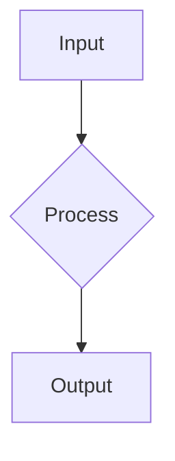

# Coursify Authoring Workflows

## The 6-Phase Authoring Lifecycle

Every course progresses through these phases, tracked by `authoringStatus`:

```
idea → researching → planned → drafting → reviewing → ready → published
```

### Phase 1: Planning (`idea` → `planned`)

**Goal:** Define scope, audience, and learning outcomes.

**Deliverables:**

- Target audience description
- 3-5 learning objectives
- Prerequisites list
- Course outcome statement
- High-level outline

**Key Fields in `info.yaml`:**

```yaml
targetAudience: 'Software engineers with 2+ years experience'
learningObjectives:
  - 'Understand core concepts'
  - 'Apply techniques in practice'
  - 'Evaluate trade-offs'
prerequisites:
  - 'Basic programming knowledge'
outcome: 'Build production-ready systems'
outline: |
  Module 1: Fundamentals
  - Section 1: Introduction
  - Section 2: Core Concepts
```

### Phase 2: Research (`researching`)

**Goal:** Gather authoritative sources and validate approach.

**Deliverables:**

- Research notes with sources
- Key findings and insights
- Validation that approach is sound

**Adding Research Notes:**

```yaml
researchNotes:
  - title: 'Understanding X Pattern'
    summary: 'Key insight about the pattern'
    sourceUrl: 'https://example.com/article'
    sourceType: 'web' # web, paper, book, video, other
    notes: 'Relevant quotes and takeaways'
    accessedAt: '2026-05-13'
```

### Phase 3: Structure (`planned`)

**Goal:** Create modules and sections with clear hierarchy.

**Deliverables:**

- Modules with learning goals
- Sections with estimated duration
- Clear ordering and organization

**CLI Commands:**

```bash
coursify init-module "Getting Started" --order 1
coursify init-section "Introduction" --module m1-getting-started --order 1
coursify init-section "Setup Lab" --module m1-getting-started --order 2
```

All sections are created with a universal template containing examples of all block types. Edit the template to use only the blocks needed for that section.

### Phase 4: Authoring (`drafting`)

**Goal:** Write content using Magic Blocks with proper pedagogy.

**Deliverables:**

- Complete markdown content with blocks
- External resources linked
- All sections drafted

### Phase 5: Review (`reviewing`)

**Goal:** Validate content quality, pedagogy, and structure.

**Validation Checklist:**

- [ ] All sections have learning goals
- [ ] All sections end with a quiz
- [ ] No Level 1 headers (`#`) in section content
- [ ] Mermaid diagrams render correctly
- [ ] Code examples are accurate
- [ ] Estimated durations are realistic
- [ ] Resources are current and accessible
- [ ] Tone is consistent throughout
- [ ] Technical accuracy verified

**Validation Command:**

```bash
coursify validate .
```

### Phase 6: Publishing (`ready` → `published`)

**Goal:** Deploy course to production.

**Publishing Commands:**

```bash
# Preview changes (dry run)
coursify publish . --dry-run

# Sync to server
coursify publish .

# Sync and mark as published
coursify publish . --publish

# Verbose mode for debugging
coursify publish . --verbose
```

---

## High-Quality Section Design

A premium section should follow this pedagogical flow:

```
Introduction/Context (MdBlock)
    ↓
Visual Demonstration (VideoBlock or Mermaid in MdBlock)
    ↓
Detailed Instruction (MdBlock)
    ↓
Procedural Breakdown (StepByStepBlock)
    ↓
Interactive Check (QuizBlock)
    ↓
Further Learning (ResourceBlock)
```

### The "Concept-Context-Check" Framework

Every block sequence should follow this instructional cycle:

1. **Concept**: Introduce the technical definition (MdBlock with `##` heading)
2. **Context**: Show the concept in action (StepByStepBlock or VideoBlock)
3. **Check**: Validate understanding (QuizBlock with 3-5 questions)

### Standardized Section Template

````markdown
## [MdBlock]

## Primary Concept Title

High-level introduction to the core concept.


````

### Detailed Sub-topic

In-depth technical explanation.

---

## [StepByStepBlock]

title: "Process or Setup Name"
showNumbering: true

- step: "Step Title"
  content: "Detailed explanation of the step."

---

## [MdBlock]

## Example

Include a realistic example or case study.

## Practice

Give the learner a small exercise or lab task.

## Common Mistakes

Call out likely misunderstandings and anti-patterns.

## Recap

Summarize in 3-5 crisp bullets.

---

## [QuizBlock]

- question: "What is X?"
  options: ["Option A", "Option B", "Option C"]
  correctAnswer: "Option B"
  explanation: "Explanation of why this is correct."

---

## [ResourceBlock]

url: https://example.com/docs
title: "Official Documentation"
type: "doc"

```

---

## Procedural Tutorials (StepByStepBlock)

Use `StepByStepBlock` for:
- State transitions and protocol handshakes
- Hardware assembly and setup procedures
- Data flow and system architecture walkthroughs
- Installation and configuration steps

**Configuration:**
- Use `showNumbering: true` for strict sequences
- Use `showNumbering: false` for iterative or parallel phases

---

## Local-First Authoring (File-System Workflow)

### Directory Structure

```

my-awesome-course/
├── info.yaml # Course metadata & planning workspace
├── agent.yaml # Agent configuration (optional)
├── m1-module-name/
│ ├── info.yaml # Module metadata
│ ├── s1-section-name/
│ │ ├── info.yaml # Section metadata
│ │ └── data.md # Markdown content (source of truth)
│ ├── s2-another-section/
│ │ ├── info.yaml
│ │ └── data.md
│ └── s3-quiz-section/
│ ├── info.yaml
│ └── data.md
└── m2-another-module/
├── info.yaml
└── s1-section/
├── info.yaml
└── data.md

````

### Metadata Mapping

**Course (`info.yaml`):**
- `title`, `slug`, `description`, `difficulty`, `tags`, `estimatedDuration`
- `targetAudience`, `learningObjectives[]`, `prerequisites[]`
- `outcome`, `outline`, `planningNotes`, `agentNotes`
- `researchNotes[]` (with title, summary, sourceUrl, sourceType, notes, accessedAt)

**Module (`info.yaml`):**
- `title`, `summary`, `learningGoals[]`, `order`, `status`

**Section (`data.md`):**
- **Frontmatter**: `title`, `summary`, `learningGoals[]`, `estimatedDuration`, `order`, `status`, `resources[]`
- **Body**: Magic Blocks (MdBlock, StepByStepBlock, QuizBlock, VideoBlock, ResourceBlock)

### Packaging & Publishing

```bash
# Preview changes without uploading
coursify publish . --dry-run

# Sync to production
coursify publish .

# Sync and immediately mark as published on the UI
coursify publish . --publish

# Verbose mode for debugging
coursify publish . --verbose
````

**Important:** The CLI uses slug-based upsert. If a course with the same slug exists on the server, it will be updated (not duplicated).

---

## Studio Workspace (Web Editor)

The platform also provides a web-based editor with:

- **Dynamic Addition**: Mouse over the line between blocks to use the Quick Adder for precise insertion
- **Magic Import**: Paste structured Markdown into the "Import" tab for instant block generation
- **Round-trip Export**: Use the "Export" tab to back up content or edit it locally

---

## Tips for Success

1. **Start with Planning**: Don't skip the planning phase. Clear objectives lead to better content.
2. **Research Thoroughly**: Document your sources. This helps with credibility and future updates.
3. **Use Mermaid Diagrams**: Embed them in MdBlock to visualize complex concepts early in the section.
4. **Always End with Quiz**: Every section should have a QuizBlock to verify learning.
5. **Validate Before Publishing**: Run `coursify validate .` to catch issues early.
6. **Use Consistent Tone**: Maintain a professional, approachable tone throughout.
7. **Test Code Examples**: Ensure all code snippets are accurate and runnable.
8. **Estimate Realistically**: Be honest about how long each section takes to complete.
