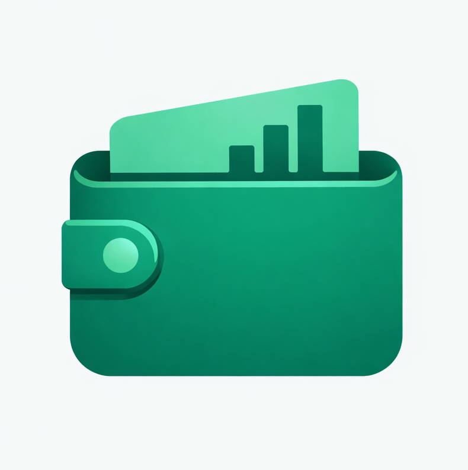

# Portfolio & Multi-App AI Platform

[](https://nextjs.org/)
[](https://reactjs.org/)
[](https://tailwindcss.com/)
[](https://www.mongodb.com/)
[](https://opensource.org/licenses/MIT)

A modern, high-performance full-stack portfolio and productivity ecosystem built with **Next.js 15** and **React 19**. This platform isn't just a resume; it's a comprehensive suite featuring an advanced multi-agent AI system, built-in productivity applications (Pocketly, Taskly, Snaplinks), privacy-focused analytics, and a powerful Admin CMS.

---

## 🚀 Key Features

### 🏢 Dynamic Portfolio & CMS

- **Content Management:** Fully dynamic sections for Hero, About, Services, Skills, and Testimonials managed via a secure Admin panel.
- **Projects & Articles:** Showcases projects with rich image galleries and markdown-supported blog articles.
- **Global Search:** Real-time fuzzy search across the entire platform powered by `Fuse.js`.

### 📊 Custom Analytics & Privacy

- **Privacy-First:** Local session tracking and event logging without third-party cookies.
- **Bot Filtering:** Robust User-Agent parsing to separate genuine traffic from crawlers.
- **Real-time Insights:** Interactive engagement charts using `Chart.js` in the Admin dashboard.

### 🔒 Security & Optimization

- **Role-Based Access:** Secure Admin panel protected by NextAuth.js.
- **Encryption:** AES-256 encryption for sensitive API keys and credentials.
- **Rate Limiting:** Built-in protection against API abuse and DDoS attempts.

---

## 🤖 Multi-Agent AI System

Leveraging LangChain and multi-provider support (OpenAI, Google Gemini), the platform features specialized agents:

- **Conversational Assistants:**
  - **Fast:** Optimized for speed (GPT-4o-mini).
  - **Pro:** Optimized for accuracy (GPT-4o).
  - **Thinking:** Deep reasoning for complex logic (o1-preview).
- **Media & Visual Agents:**
  - **Image Analyzer:** Indexes images with AI descriptions for semantic search.
  - **Image Generator & Editor:** Create and modify images directly from text prompts.
  - **Visual Search:** Vector-based semantic search via Qdrant.
- **Content & Coding Agents:**
  - **Blog Writer:** Assists in drafting and outlining markdown articles.
  - **Code Reporter:** Analyzes codebase snippets for reviews and issue templates.

---

## 💼 Built-in Applications

### 💰 Pocketly Tracker

A comprehensive finance management tool integrated directly into your dashboard.

- Track accounts, transactions, and budgets.
- AI-driven finance insights and chat.
- Visual reports and categorization.



### 📋 Taskly

A robust task management system for personal and project productivity.

- Kanban boards and issue tracking.
- Project-based organization.
- Seamless integration with the platform's ecosystem.


### 🔗 SnapLinks

A powerful built-in URL shortener and tracking tool.

- Create custom redirect links (`/r/slug`).
- Track individual click analytics and referrers.
- Manage all links through the Admin CMS.


---

## 🛠️ Tech Stack

- **Framework:** Next.js 15 (App Router), React 19
- **Styling:** Tailwind CSS 4, GSAP, Framer Motion
- **Database:** MongoDB (Mongoose), Qdrant (Vector DB)
- **AI Ecosystem:** LangChain, OpenAI, Google Gemini, Model Context Protocol (MCP)
- **Authentication:** NextAuth.js
- **Media Storage:** UploadThing, Cloudinary
- **State Management:** React Context, Fuse.js

---

## ⚙️ Getting Started

### Prerequisites

- **Node.js:** v18.0.0 or higher
- **Package Manager:** `pnpm` (recommended), `npm`, or `yarn`
- **Database:** MongoDB (Local or Atlas)
- **API Keys:** OpenAI, Google Gemini, Cloudinary (optional, for full feature support)

### 1. Clone the repository

```bash
git clone https://github.com/hasanraiyan/resume.git
cd resume
```

### 2. Install dependencies

```bash
pnpm install
```

### 3. Environment Configuration

The platform includes an interactive setup wizard to generate secrets and configure your `.env` file automatically.

```bash
pnpm run project-setup
```

_Alternatively, copy `.env.example` to `.env` and fill in the required fields manually._

### 4. Seed Database (Optional)

To populate the CMS with sample data:

```bash
node scripts/seed-cms.js
```

### 5. Start Development

```bash
pnpm run dev
```

Visit `http://localhost:3000` to see the site. The Admin panel is accessible at `/admin`.

---

## 📁 Project Structure

```text
.
├── scripts/              # Setup, seed, and migration scripts
├── src/
│   ├── app/              # Next.js App Router (Pages & API)
│   │   ├── (admin)/      # Protected Admin CMS routes
│   │   ├── api/          # API endpoints (Auth, AI, CMS)
│   │   ├── pocketly/     # Pocketly Tracker application
│   │   └── taskly/       # Taskly task management
│   ├── components/       # UI Components (Admin, Apps, UI)
│   ├── lib/              # Utilities, AI Agents, and Integrations
│   ├── models/           # Mongoose Database Schemas
│   └── context/          # React Global Context providers
├── public/               # Static assets and images
└── middleware.js         # Security & Auth middleware
```

---

## 🤝 Contributing

Contributions are what make the open-source community such an amazing place to learn, inspire, and create. Any contributions you make are **greatly appreciated**.

1. Fork the Project
2. Create your Feature Branch (`git checkout -b feature/AmazingFeature`)
3. Commit your Changes (`git commit -m 'Add some AmazingFeature'`)
4. Push to the Branch (`git push origin feature/AmazingFeature`)
5. Open a Pull Request

---

## 📄 License

Distributed under the MIT License. See `LICENSE` for more information.

---

Created with ❤️ by [Hasan Raiyan](https://hasanraiyan.me)
