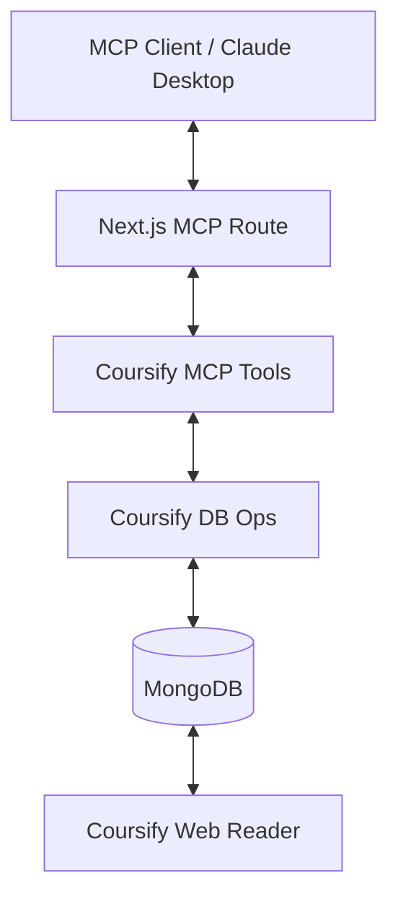

# Coursify MCP

## Overview

Coursify MCP is a specialized **Model Context Protocol (MCP)** server integrated into the platform to enable AI agents to research, plan, and author high-quality educational courses. It provides a structured interface for AI to interact with the Coursify backend, managing everything from initial topic research to final publication.

## Purpose

The primary goal of Coursify MCP is to turn an AI assistant into a professional **Instructional Designer**. By providing a set of granular tools and a strict authoring guide, the MCP ensures that AI-generated courses follow educational best practices, including clear learning objectives, structured modules, practical examples, and knowledge-checks.

## Architecture

Coursify MCP is embedded directly within the Next.js application as a set of MCP tools. It communicates with the same MongoDB database used by the main platform, ensuring data consistency across the web reader and the AI authoring environment.



## Core Features & Workflows

### 1. Research & Discovery

AI agents can search for existing courses to avoid duplication and save research findings (notes, sources, key takeaways) directly to the course context.

- **Tools**: `list_courses`, `search_courses`, `add_research_note`, `research_findings` (batch).

### 2. Planning & Strategy

The agent defines the target audience, learning objectives, and a high-level outline before writing content.

- **Tools**: `save_course_plan`, `get_course_authoring_guide`.

### 3. Automated Structuring

Based on a Markdown outline, the MCP can suggest and automatically generate a logical module and section hierarchy.

- **Tools**: `suggest_modules_from_outline`, `apply_suggested_modules`.

### 4. Content Authoring

Agents write course sections using full Markdown support, including Mermaid diagrams for visuals and LaTeX for mathematical formulas.

- **Tools**: `add_sections` (batch), `update_section`, `set_quiz_questions`.

### 5. Quality Control & Progress

Track course completeness and get AI-driven recommendations for the next steps.

- **Tools**: `get_course_progress`, `get_course_workspace`.

---

## Tool Reference

| Category       | Key Tools                                    | Description                                                |
| :------------- | :------------------------------------------- | :--------------------------------------------------------- |
| **Meta**       | `get_course_authoring_guide`                 | Returns the instructional design quality bar and workflow. |
| **Planning**   | `save_course_plan`, `add_research_note`      | Persists the strategy and research notes for a course.     |
| **Structure**  | `apply_suggested_modules`, `reorder_modules` | Manages the hierarchy of modules and sections.             |
| **Content**    | `add_sections`, `set_quiz_questions`         | The primary tools for writing lessons and assessments.     |
| **Management** | `publish_course`, `get_course_progress`      | Handles the course lifecycle and completeness tracking.    |

---

## Workflow Guide: The Authoring Lifecycle

1.  **Research**: Gather sources and save them using `research_findings`.
2.  **Plan**: Define objectives and outline using `save_course_plan`.
3.  **Structure**: Generate modules from the outline using `apply_suggested_modules`.
4.  **Draft**: Write sections in batches using `add_sections`.
5.  **Review**: Check progress with `get_course_progress`.
6.  **Publish**: Mark the course as ready using `publish_course`.

---

## Setup Instructions

To use Coursify MCP with a compatible client like **Claude Desktop**:

1.  **Obtain API Credentials**: Ensure you have an active session or API key for the platform.
2.  **Configure MCP Client**: Add the following to your MCP configuration (e.g., `claude_desktop_config.json`):

```json
{
  "mcpServers": {
    "coursify": {
      "command": "node",
      "args": ["path/to/your/project/src/lib/mcp/coursify/index.js"],
      "env": {
        "MONGODB_URI": "your_mongodb_uri",
        "NEXTAUTH_SECRET": "your_secret"
      }
    }
  }
}
```

_Note: Since the server is integrated into Next.js, it is typically accessed via the platform's MCP SSE or WebStandard transport in production._

---

## Future Roadmap

- [ ] **Dedicated Admin UI**: A visual dashboard for managing AI-authored courses.
- [ ] **AI Thumbnail Generation**: Automated thumbnail creation for new courses.
- [ ] **Collaboration Tools**: Multi-agent authoring support.
- [ ] **Advanced Assessments**: More quiz types (matching, drag-and-drop).
