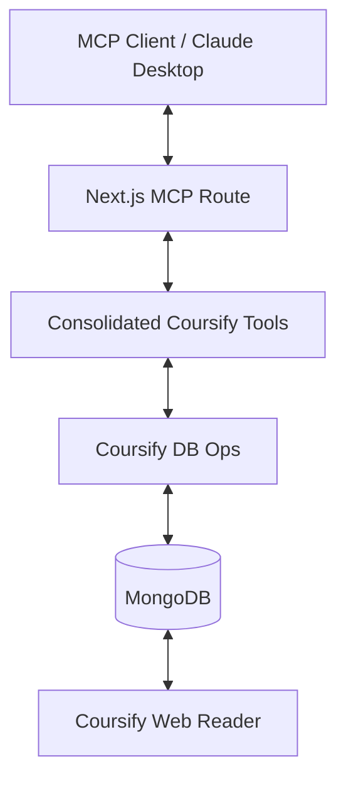

# Coursify MCP

## Overview

Coursify MCP is a specialized **Model Context Protocol (MCP)** server integrated into the platform to enable AI agents to research, plan, and author high-quality educational courses. It provides a structured interface for AI to interact with the Coursify backend, managing everything from initial topic research to final publication.

## Purpose

The primary goal of Coursify MCP is to turn an AI assistant into a professional **Instructional Designer**. By consolidating 32 granular operations into a streamlined set of ~14 powerful tools, the MCP ensures that AI-generated courses follow educational best practices without overwhelming the agent with excessive options.

## Architecture

Coursify MCP is embedded directly within the Next.js application. It shares the same MongoDB database and shared logic (`db-ops.js`) as the web reader, ensuring a seamless transition from AI authoring to user consumption.

## Streamlined Workflows

### 1. Discovery & Context Loading

The `get_course` tool is the primary entry point for context. It can fetch metadata, full content, research findings, and a progress report in a single call using optional flags.

- **Tools**: `list_courses`, `get_course`.

### 2. Strategy & Lifecycle

All metadata updates, planning (audience, objectives, outline), and status changes (authoring status, publication) are handled by a single `upsert_course` tool.

- **Tools**: `upsert_course`, `get_authoring_guide`.

### 3. Structural Automation

AI agents can analyze an outline to get module suggestions and then apply them to automatically generate the course hierarchy.

- **Tools**: `analyze_outline`, `upsert_module`, `reorder_modules`.

### 4. Content Writing

The `upsert_section` tool handles single section creation/updates, batch creation of multiple sections, and quiz question management.

- **Tools**: `get_section`, `upsert_section`, `reorder_sections`.

### 5. Research Management

Agents can save multiple research findings (sources, quotes, key takeaways) in a single batch call.

- **Tools**: `manage_research`.

---

## Tool Reference

| Category   | Tool                  | Description                                                  |
| :--------- | :-------------------- | :----------------------------------------------------------- |
| **Meta**   | `get_authoring_guide` | Quality bar, workflows, and Mermaid/LaTeX templates.         |
| **Meta**   | `list_courses`        | List all courses or search by keywords/tags.                 |
| **Read**   | `get_course`          | Fetch metadata, content, research, and progress (via flags). |
| **Read**   | `get_section`         | Fetch full Markdown content and quiz for one section.        |
| **Write**  | `upsert_course`       | Create/Update course, plan, agentNotes, and status.          |
| **Write**  | `upsert_module`       | Create or update a module grouping.                          |
| **Write**  | `upsert_section`      | Create/Update sections (single or batch) and quizzes.        |
| **Write**  | `manage_research`     | Save one or more research findings.                          |
| **Write**  | `analyze_outline`     | Suggest modules from outline or apply them automatically.    |
| **Order**  | `reorder_modules`     | Reorder modules within a course.                             |
| **Order**  | `reorder_sections`    | Reorder sections within a course or module.                  |
| **Delete** | `delete_courses`      | Soft-delete one or more courses.                             |
| **Delete** | `delete_modules`      | Soft-delete one or more modules.                             |
| **Delete** | `delete_sections`     | Soft-delete one or more sections.                            |

---

## Workflow Guide: The Authoring Lifecycle

1.  **Research**: Gather sources and save them using `manage_research`.
2.  **Plan**: Define objectives and outline using `upsert_course`.
3.  **Structure**: Generate modules from the outline using `analyze_outline(apply: true)`.
4.  **Draft**: Write sections in batches using `upsert_section(batch: [...])`.
5.  **Review**: Check gaps with `get_course(includeProgress: true)`.
6.  **Publish**: Mark the course as ready using `upsert_course(status: "published")`.

---

## Technical Details

- **Diagrams**: Use \`\`\`mermaid blocks for interactive SVG diagrams.
- **Math**: Use LaTeX syntax ($...$ for inline, $$...$$ for display math).
- **Persistence**: Use the `agentNotes` field in `upsert_course` to save your internal working state between sessions.
