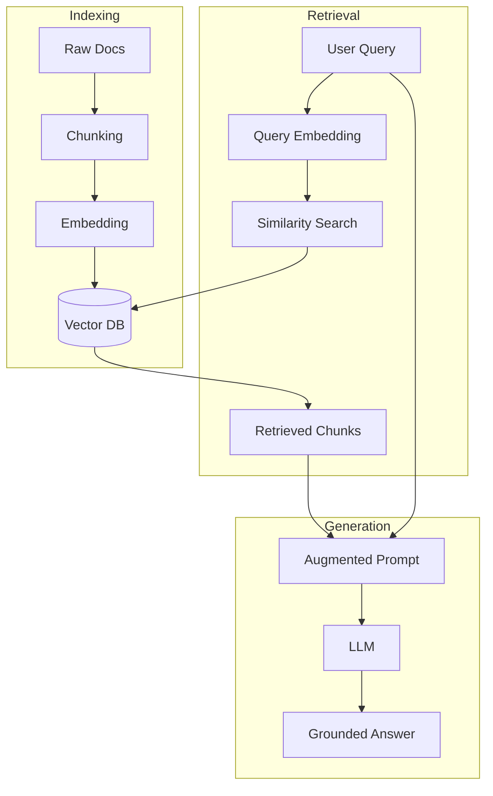

# Blocks

## [MdBlock]

### The 3 Pillars of RAG

A professional RAG system is not just one script; it is a multi-stage data pipeline. To build one, you must master three distinct architectural stages:

1.  **Indexing (Offline)**: Preparing your data. This happens _before_ the user asks a question.
2.  **Retrieval (Online)**: Finding the relevant data in milliseconds.
3.  **Generation (Online)**: Using the data to create a high-quality answer.

---

## [VideoBlock]

url: https://youtu.be/tcqE7J1G1i4
title: Building a RAG Pipeline From Scratch

---

## [StepByStepBlock]

title: The Indexing (ETL) Pipeline
showNumbering: true

- step: Data Ingestion
  content: Loading raw files (PDFs, Markdown, Web Pages) into the system using specialized loaders.
- step: Document Chunking
  content: Breaking large documents into smaller pieces (e.g., 500-token snippets) so the model isn't overwhelmed.
- step: Vector Embedding
  content: Converting each chunk into a high-dimensional array of numbers (a vector) that represents its meaning.
- step: Vector Storage
  content: Saving the vectors and their original text in a specialized Vector Database (like Pinecone, Chroma, or Weaviate).

---

## [StepByStepBlock]

title: The Retrieval & Generation Loop
showNumbering: true

- step: Query Transformation
  content: Converting the user's natural language question into a vector using the _same_ embedding model used in indexing.
- step: Semantic Search
  content: Finding the "Top K" (e.g., Top 5) chunks in the database that are mathematically closest to the query vector.
- step: Context Stuffing
  content: Formatting the retrieved text snippets into a prompt template alongside the user's query.
- step: Grounded Generation
  content: Sending the prompt to the LLM and receiving an answer backed by the retrieved evidence.

---

## [QuizBlock]

title: Architecture Knowledge Check

- question: Why is 'Chunking' necessary during the Indexing stage?
  type: multiple_choice
  options:
  - To make the files smaller for the server hard drive.
  - To fit within the LLM's context window and improve retrieval precision.
  - Because models can only read 10 words at a time.
  - To encrypt the data for security.
    correctAnswer: To fit within the LLM's context window and improve retrieval precision.
    explanation: Models have limited "memory" (context windows). Chunks ensure we only provide the most relevant fragments rather than entire 100-page PDFs.

- question: Which database type is specifically optimized for RAG retrieval?
  type: multiple_choice
  options:
  - Relational (SQL)
  - Key-Value (Redis)
  - Vector Database
  - Graph Database
    correctAnswer: Vector Database
    explanation: Vector databases are built to perform "Similarity Search" across high-dimensional embeddings, which is the heart of the RAG retrieval process.

---

## [ResourceBlock]

url: https://www.llamaindex.ai/
title: LlamaIndex - RAG Orchestration Framework
type: doc
