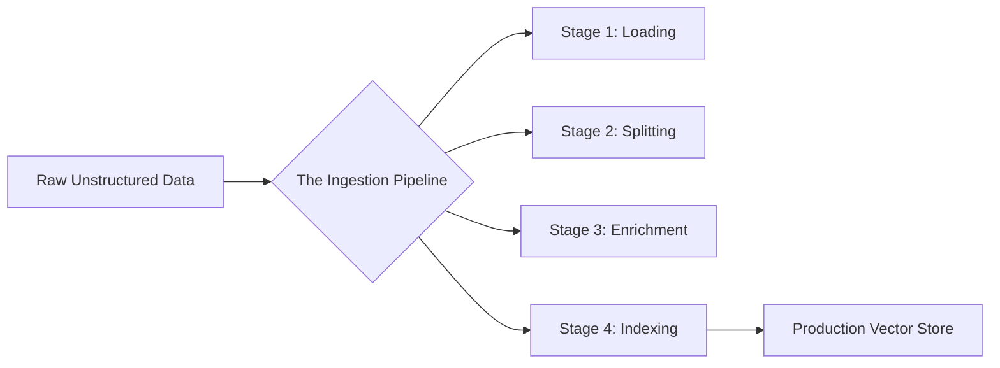

# Blocks

## [MdBlock]

### The Ingestion ETL Framework

In professional RAG engineering, your output quality is strictly bound by your input quality. This is known as **GIGO (Garbage In, Garbage Out)**. If you ingest a PDF that contains noisy headers, messy footers, or broken tables, the embedding model will generate a "blurred" vector that points to the wrong information.

**Document Processing** is the "Transform" phase of the AI lifecycle. We must take unstructured, messy data and convert it into high-fidelity, searchable knowledge.

---

## [VideoBlock]

url: https://youtu.be/tcqE7J1G1i4
title: High-Fidelity Document Ingestion Explained

---

## [MdBlock]

### Why Precision Matters

When an LLM answers a question, it doesn't "know" everything. It only knows what you put in the prompt. If your ingestion pipeline is imprecise, you suffer from:

1.  **Signal Dilution**: Relevant facts are buried in 10 pages of legal fluff.
2.  **Context Overload**: The model hits its token limit before finding the answer.
3.  **Semantic Noise**: Formatting junk (like `\n\n\n\n`) changes the "meaning" of the vector.

> Always use a **Normalization** step. Clean your text of non-ASCII characters, excessive newlines, and duplicative boilerplate before it ever touches an embedding model.

---

## [StepByStepBlock]

title: The Data Journey: Raw to Vector
showNumbering: true

- step: Source Extraction
  content: "Connect to the source (e.g., a Confluence Wiki) and pull the raw HTML or Markdown content into the system memory."
- step: Content Cleaning
  content: "Strip out irrelevant elements like navigation bars, sidebars, and CSS styles that don't contribute to the knowledge base."
- step: Semantic Boundary Detection
  content: "Identify logical breaks in the text (e.g., where a new chapter begins) to ensure chunks don't cut off in the middle of a sentence."
- step: Vectorization
  content: "Pass the clean text through an embedding model (like `text-embedding-3-small`) to create a mathematical fingerprint."

---

## [QuizBlock]

title: Ingestion Foundations Check

- question: What is the main danger of skipping the 'Cleaning' stage in document processing?
  type: multiple_choice
  options:
  - The LLM will take too long to generate an answer.
  - The embedding vectors will be 'noisy,' leading to lower retrieval accuracy and more hallucinations.
  - The database will run out of space.
  - It is only a problem for English text.
    correctAnswer: The embedding vectors will be 'noisy,' leading to lower retrieval accuracy and more hallucinations.
    explanation: Noise in the text (formatting junk, boilerplate) changes the resulting vector, making it harder for the search engine to find truly relevant content.

- question: Which stage is responsible for breaking a 100-page manual into 500-token snippets?
  type: multiple_choice
  options:
  - Loading
  - Splitting (Chunking)
  - Enrichment
  - Generation
    correctAnswer: Splitting (Chunking)
    explanation: Splitting is the process of decomposing large documents into smaller pieces that fit into the LLM's context window.

---

## [ResourceBlock]

url: https://python.langchain.com/docs/modules/data_connection/
title: LangChain Data Connection Overview
type: doc
