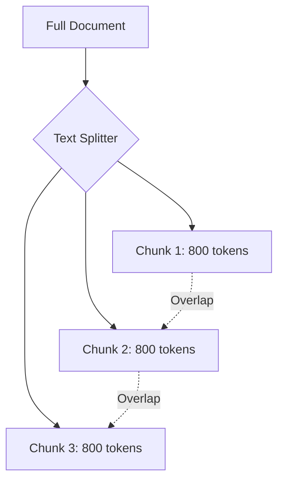

# Blocks

## [MdBlock]

### The Geometry of Information

You cannot feed a 300-page book into an LLM's retrieval window. To get high-precision results, we must chop documents into smaller pieces called **Chunks**.

The challenge is **Splitting at the Right Spot**. If you split a sentence in half, you lose the meaning. The goal of a **Text Splitter** is to keep related pieces of information together while staying within the limits of the model's context window.



---

## [VideoBlock]

url: https://youtu.be/8u_X_0Uu6Yc
title: Text Splitting and Chunking Strategies

---

## [MdBlock]

### The Recursive Character Splitter

This is the industry standard. Instead of just cutting text every 500 characters, it tries to split on logical boundaries in a specific order:

1.  **Paragraphs** (`\n\n`)
2.  **Sentences** (`\n`)
3.  **Words** (` `)
4.  **Characters** (``)

```python
from langchain_text_splitters import RecursiveCharacterTextSplitter

splitter = RecursiveCharacterTextSplitter(
    chunk_size=1000,
    chunk_overlap=200,
    add_start_index=True
)

chunks = splitter.split_documents(docs)
```

> **Chunk Overlap** (e.g., 200 characters) creates a "sliding window." It repeats the end of one chunk at the beginning of the next, ensuring that if a fact was mentioned at the boundary, the model sees enough surrounding context to understand it.

---

## [StepByStepBlock]

title: Configuring Your Splitter
showNumbering: true

- step: Set Chunk Size
  content: "Decide on your budget. For technical text, 800-1200 characters is usually the 'Sweet Spot' between context and precision."
- step: Define Overlap
  content: "Set a 10-20% overlap. This acts as a 'Safety Buffer' to prevent semantic context from being sliced in half."
- step: Handle Code Blocks
  content: "If your document contains Python or Javascript, use a language-specific splitter like `from_language(Language.PYTHON)` to split on function and class boundaries."
- step: Verify Indices
  content: "Set `add_start_index=True`. This allows you to map the chunk back to its exact character position in the original file."

---

## [QuizBlock]

title: Splitting Mastery Check

- question: Why is a 'Recursive' splitter preferred over a 'Character' splitter?
  type: multiple_choice
  options:
  - Because it is faster.
  - Because it attempts to keep paragraphs and sentences together before falling back to character splits.
  - Because it uses more RAM.
  - Because it only works on Windows.
    correctAnswer: Because it attempts to keep paragraphs and sentences together before falling back to character splits.
    explanation: Recursive splitters are "semantic-aware." They respect the structure of the document (paragraphs, then sentences) to ensure the text remains readable and coherent.

- question: What is the main purpose of 'Chunk Overlap'?
  type: multiple_choice
  options:
  - To make the database larger.
  - To provide enough surrounding context for the LLM to understand facts that appear near the edge of a chunk.
  - To translate the text.
  - To encrypt the text.
    correctAnswer: To provide enough surrounding context for the LLM to understand facts that appear near the edge of a chunk.
    explanation: Overlap ensures that the "edges" of your data are not lost, allowing the LLM to see the "before and after" of a specific sentence.

---

## [ResourceBlock]

url: https://python.langchain.com/docs/modules/data_connection/document_transformers/
title: Deep Dive into Text Splitters
type: doc
