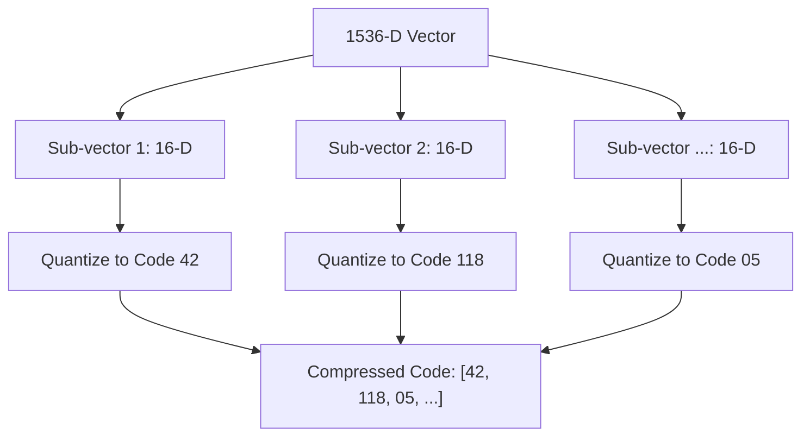

# Blocks

## [MdBlock]

### The RAM Bottleneck in Production

Storing raw vectors is expensive. A single 1536-dimensional vector (OpenAI) takes ~6 KB. For a dataset of 100 million vectors, you need **600 GB of high-speed RAM**—costing thousands of dollars per month in cloud infrastructure.

**Product Quantization (PQ)** is the lossy compression technique that solves this. It reduces the memory footprint by 10x to 100x by replacing full-precision floats with byte-sized indices.

---

## [VideoBlock]

url: https://youtu.be/8u_X_0Uu6Yc
title: Product Quantization in 5 Minutes

---

## [MdBlock]

### Asymmetric Distance Computation (ADC)

The magic of PQ is that it doesn't need to "decompress" the data to search it. Using **ADC**, the system keeps the user's query in full precision but compares it to the "Codebook" (the average patterns) of the compressed data.

| Method         | Data Storage         | Computation | Memory Usage |
| :------------- | :------------------- | :---------- | :----------- |
| **Flat Index** | Full Floats (32-bit) | Precise     | 100%         |
| **IVF-PQ**     | Byte Indices (8-bit) | Approximate | **1% - 10%** |

---

## [StepByStepBlock]

title: The PQ Compression Workflow
showNumbering: true

- step: Training Phase
  content: "The system runs a **k-means clustering** algorithm on a sample of your data to find the most common 'patterns' (centroids) for every sub-vector."
- step: Vector Decomposition
  content: "Each incoming vector is chopped into $M$ sub-vectors (e.g., 1536 chopped into 96 pieces of 16 dimensions each)."
- step: Index Assignment
  content: "Each piece is replaced by the index of the centroid it most closely matches. A huge float array becomes a tiny array of integers."
- step: Lookup Table Search
  content: "At query time, the system pre-calculates the distance from the query to all possible centroids and stores them in a fast lookup table for instant retrieval."

---

## [QuizBlock]

title: Compression Knowledge Check

- question: What is the primary engineering benefit of Product Quantization?
  type: multiple_choice
  options:
  - It makes the AI smarter.
  - It drastically reduces the RAM required to store and search massive vector databases.
  - It translates vectors into different languages.
  - It only works on GPUs.
    correctAnswer: It drastically reduces the RAM required to store and search massive vector databases.
    explanation: PQ is all about memory efficiency, allowing billion-scale datasets to fit on affordable server hardware.

- question: Is Product Quantization a 'lossless' or 'lossy' technique?
  type: multiple_choice
  options:
  - Lossless (No data is changed)
  - Lossy (Small amount of precision is traded for massive space gains)
    correctAnswer: Lossy (Small amount of precision is traded for massive space gains)
    explanation: PQ is lossy because it represents a group of similar vectors with a single 'average' centroid index.

- question: Why is the 'Training Phase' required for Product Quantization?
  type: multiple_choice
  options:
  - To teach the LLM new facts.
  - To build a codebook of optimal centroids (patterns) that best represent your specific dataset.
  - To speed up the internet connection.
  - To encrypt the database password.
    correctAnswer: To build a codebook of optimal centroids (patterns) that best represent your specific dataset.
    explanation: PQ depends on clustering. The codebook needs to know what the "typical" vectors in your dataset look like to compress them accurately.

---

## [ResourceBlock]

url: https://www.pinecone.io/learn/series/faiss/product-quantization/
title: Deep Dive into Vector Compression
type: article
