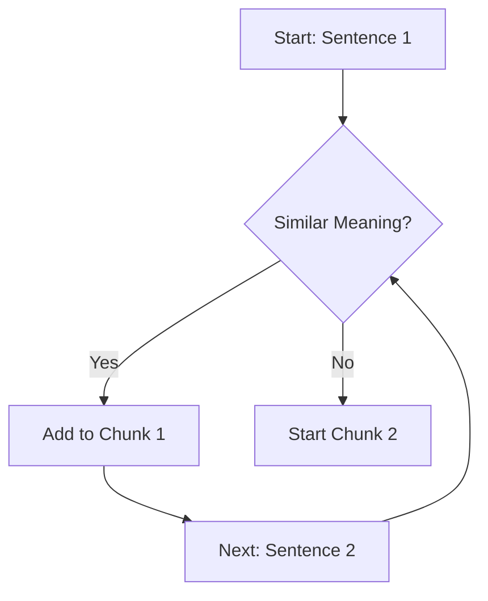

# Blocks

## [MdBlock]

### The "Goldilocks" Problem of Chunking

Choosing a chunk size is not a one-size-fits-all engineering task. You must balance the **Precision** of the search result against the **Context** required for the model to answer correctly.

- **Too Small**: Chunks may lack enough surrounding context for the LLM to understand them (e.g., just a single bullet point without its header).
- **Too Large**: Chunks may contain too much irrelevant information, "diluting" the signal and potentially wasting the LLM's expensive context window.

| Data Type              | Recommended Size         | Strategy                                       |
| :--------------------- | :----------------------- | :--------------------------------------------- |
| **Q&A / FAQ**          | Small (100-300 tokens)   | Keep each question/answer pair as one chunk.   |
| **Technical Manuals**  | Medium (500-1000 tokens) | Respect sub-headers and procedural steps.      |
| **Legal / Compliance** | Large (1500+ tokens)     | Context and surrounding clauses are mandatory. |

---

## [VideoBlock]

url: https://youtu.be/gjPcSpoLnsw
title: Optimizing Chunk Sizes for RAG

---

## [MdBlock]

### The Semantic Evolution

Standard character-based chunking is primitive. In 2026, the gold standard is **Semantic Chunking**. Instead of counting characters, we use an embedding model to look for "Meaningful Breaks."

The system groups sentences together as long as they stay within a certain "Semantic Distance" of each other. Once the topic shifts, a new chunk is started.

---

## [StepByStepBlock]

title: The Chunk Evaluation Workflow
showNumbering: true

- step: Identify "Edge Information"
  content: "Search your document for facts that depend heavily on surrounding text (e.g., a chart caption)."
- step: Run Test Queries
  content: "Ask the system to retrieve these facts. Check if the retrieved chunk contains the _full_ answer or only a useless fragment."
- step: Tuning
  content: "Increase the chunk size or overlap if the LLM is constantly saying 'I don't have enough context.' Decrease it if the LLM is getting distracted by irrelevant noise."
- step: Metadata Tracking
  content: "Always store the `document_id` and `chunk_index` so you can manually inspect and verify the quality of your most-retrieved chunks."

---

## [QuizBlock]

title: Chunking Decision Check

- question: Why is 'Semantic Chunking' often more accurate than 'Fixed-size' chunking?
  type: multiple_choice
  options:
  - Because it is faster for the computer.
  - Because it uses AI to group related ideas together, ensuring each chunk is a complete 'thought.'
  - Because it makes the file size smaller.
  - Because it only works on cloud servers.
    correctAnswer: Because it uses AI to group related ideas together, ensuring each chunk is a complete 'thought.'
    explanation: Semantic chunking understands the "topic" of the text, so it won't cut a document in the middle of an explanation just because it hit a character limit.

- question: Which chunk size is generally best for a system built to answer quick FAQ questions?
  type: multiple_choice
  options:
  - Massive (5000 tokens)
  - Small (200 tokens)
  - Zero tokens
  - 1 character
    correctAnswer: Small (200 tokens)
    explanation: FAQ answers are usually concise. A small chunk size provides high precision without adding unnecessary noise to the prompt.

---

## [ResourceBlock]

url: https://www.pinecone.io/learn/chunking-strategies/
title: Chunking Strategies (Pinecone Academy)
type: article
