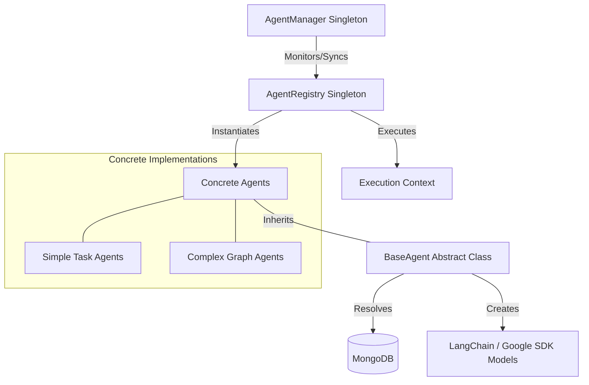

# Deep Dive Analysis: Agent Architecture & Orchestration

## Executive Summary

The application features a robust, scalable agent orchestration system designed to manage diverse AI-driven tasks—from simple image generation to complex, multi-stage blog writing. The architecture centers around a "Registry Pattern" which separates agent logic from execution context, allowing the system to dynamically initialize, configure, and monitor agents at runtime.

## 1. Core Architectural Components

The agent system is distributed across three primary management layers:

### A. The Foundation: [BaseAgent.js](file:///d:/resume/src/lib/agents/BaseAgent.js)

The abstract base class for all agents.

- **Initialization**: Automatically fetches settings from the `AgentConfig` database model on first run.
- **Provider Resolution**: Includes "Fuzzy Fallback" logic to find active providers by name (e.g., matching "google" to "gemini") and securely decrypts API keys at rest.
- **Client Factory**: Provides standard methods (`createChatModel`, `createEmbeddings`, `createGoogleGenAI`) to generate LLM clients based on the resolved provider's base URL and credentials.
- **Lifecycle Hooks**: Implements `_onInitialize`, `_validateInput`, and `_onExecute` (or `_onStreamExecute`) as protected methods for subclasses.

### B. The Catalog: [AgentRegistry.js](file:///d:/resume/src/lib/agents/AgentRegistry.js)

A singleton registry that manages agent discovery and instantiation.

- **On-Demand Instantiation**: Agents are defined as classes and only instantiated (via the `.get()` method) when first called.
- **Execution Orchestration**: Provides a unified `execute()` method that handles instantiation, rate-limit checking, and logging in one call.

### C. The Supervisor: [AgentManager.js](file:///d:/resume/src/lib/agents/AgentManager.js)

The runtime operational layer.

- **Monitoring**: Periodically collects health metrics and execution counts from all registered agents.
- **Lifecycle Control**: Provides APIs to activate/deactivate agents globally and update their configurations (model, persona, provider) on the fly via the Admin Dashboard.
- **Event System**: Emits events (e.g., `agent:activated`) for real-time monitoring of the agent ecosystem.

---

## 2. Technical Data Flow & Persistence

The system's state is persisted across three key MongoDB models:

| Model                                                                        | Purpose                                     | Key Fields                                                             |
| :--------------------------------------------------------------------------- | :------------------------------------------ | :--------------------------------------------------------------------- |
| **[AgentConfig](file:///d:/resume/src/models/AgentConfig.js)**               | Per-agent operational preferences.          | `agentId`, `providerId`, `model`, `persona`, `isActive`, `activeMCPs`. |
| **[ProviderSettings](file:///d:/resume/src/models/ProviderSettings.js)**     | Global AI Backend configurations.           | `name`, `baseUrl`, `apiKey` (Encrypted), `supportsTools`.              |
| **[MediaAgentSettings](file:///d:/resume/src/models/MediaAgentSettings.js)** | Global media processing & legacy fallbacks. | `isProcessing`, `qdrantCollection`, `isProcessing`.                    |

### Secure API Key Resolution

When an agent is initialized, it calls `resolveProvider()`. This method pulls the `ProviderSettings` matching the agent's `providerId`. It then uses a cryptographic utility to decrypt the `apiKey`. If a specific ID isn't found, it performs a search for an active provider with a similar name, ensuring high availability even if specific IDs change.

---

## 3. Implementation Patterns

Agents are categorized into two primary implementation styles:

### Pattern 1: Linear Task Agents

Used for focused, deterministic AI tasks.

- **Example**: **[image-generator-agent.js](file:///d:/resume/src/lib/agents/ai/image-generator-agent.js)**
- **Methodology**: Uses the `createGoogleGenAI` factory to access raw multimodal features (like Google's specialized image generation task) that standard LangChain abstractions may not yet fully expose.

### Pattern 2: State-Aware Graph Agents

Used for complex, multi-stage reasoning tasks. These leverage **LangGraph** to manage state across nodes.

- **Example**: **[blog-writer-agent.js](file:///d:/resume/src/lib/agents/ai/blog-writer-agent.js)**
- **Workflow**:
  1.  **Research**: Connects to live web search via MCP tools.
  2.  **Planning**: Deduces a logical outline from raw search data.
  3.  **Drafting**: Generates long-form content with embedded image prompts.
  4.  **Generative UI/Media**: Parallelizes image generation for article illustrations.
  5.  **Persistence**: Saves the final `Article` document to the database.

- **Example**: **[presentation-agent.js](file:///d:/resume/src/lib/agents/ai/presentation-agent.js)**
- **Feature**: Uses a "Design DNA" guardrail system. It first generates a structured JSON outline and then wraps every slide generation request with "quality anchors" (Style, Typography, and Composition rules) to ensure a high-end corporate deck aesthetic.

---

## 4. MCP & Tool Injection

The system makes extensive use of the **Model Context Protocol (MCP)** for grounding AI responses in real-time data or workspace context.

- **Dynamic Tool Injection**: Agents fetch their `activeMCPs` from their `AgentConfig`.
- **[MultiServerMCPClient](file:///d:/resume/src/lib/agents/ai/presentation-agent.js#L5)**: This adapter allows a single agent to communicate with multiple MCP servers (e.g., Google Search, File System, or GitHub) simultaneously.
- **Tool Mapping**: Standard tools (like `vision` or `vector_search`) are mapped to specific `AGENT_IDS` in **[lib/constants/agents.js](file:///d:/resume/src/lib/constants/agents.js)**.

---

## 5. Frontend & API Integration

The frontend primarily interacts with agents via specialized API routes which act as proxies for the `AgentRegistry`.

- **Example Route**: **[/api/tools/presentation/outline](file:///d:/resume/src/lib/agents/ai/presentation-agent.js)**
- **Execution Strategy**:
  1.  The route uses `agentRegistry.get(AGENT_IDS.PRESENTATION_SYNTHESIZER)`.
  2.  It triggers the action (e.g., `draft_outline`).
  3.  The agent manages its own LLM interactions, tool calls, and error boundaries.
  4.  The serialized JSON result is returned to the `PresentationGenerator` component.

---

## Recommendations & Roadmap

1.  **Vector Store Unification**: While `visual-search-agent` handles images, integrating the same vector patterns into the `chat-assistant` via a global RAG tool would improve cross-agent knowledge sharing.
2.  **Telemetry Dashboard**: The current `AgentManager` tracks counts, but a detailed visualization of token costs per agent vs. per provider in the Admin UI would significantly aid in cost optimization.
3.  **Cross-Agent State Sharing**: Implementing a shared "Memory Bridge" where one agent's research results can be directly accessed by another's planning node would reduce redundant LLM calls.

## Conclusion

The architecture represents a mature, enterprise-grade approach to AI orchestration. By standardizing the base behavior and utilizing industrial-strength graph orchestration for complex tasks, the application can rapidly adapt to new AI models and user requirements without restructuring the core framework.
