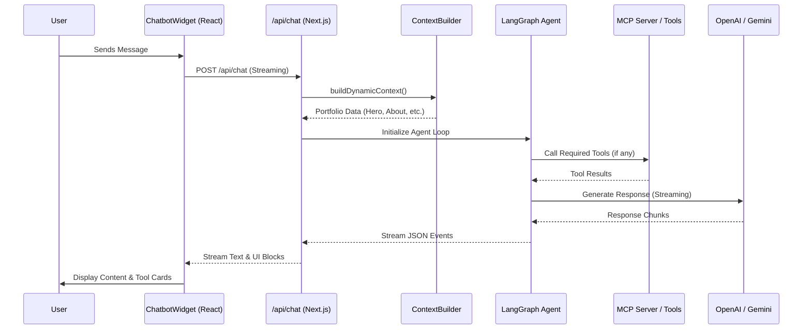

# Technical Analysis: AI Chatbot Architecture ("Kiro")

## 1. Executive Summary

This report provides a detailed technical deep-dive into the AI-powered chatbot system (internally named **Kiro**) integrated into the portfolio project. The system is designed to provide dynamic, context-aware interactions with visitors, leveraging modern AI frameworks and protocols.

The architecture is built on a "React-Next.js-LangChain" stack, utilizing **LangGraph** for robust agentic workflows and the **Model Context Protocol (MCP)** for seamless integration of external tools. The chatbot is not just a simple LLM wrapper; it is an autonomous agent capable of searching the portfolio, retrieving project details, and even drafting contact forms based on user conversations.

---

## 2. Architectural Overview

### System Architecture Diagram

The following diagram illustrates the end-to-end flow from the user's browser to the AI model and back.

### Components & Responsibilities

| Component           | File Path                                                                      | Responsibility                                                                 |
| :------------------ | :----------------------------------------------------------------------------- | :----------------------------------------------------------------------------- |
| **Main Widget**     | [ChatbotWidget.js](file:///d:/resume/src/components/chatbot/ChatbotWidget.js)  | UI state, message history, and user input handling.                            |
| **Streaming Hook**  | [useChatStreaming.js](file:///d:/resume/src/hooks/chatbot/useChatStreaming.js) | Manages SSE connection, decodes JSON events, and handles tool status messages. |
| **API Handler**     | [route.js](file:///d:/resume/src/app/api/chat/route.js)                        | Backend logic, LangGraph initialization, and MCP client coordination.          |
| **Context Builder** | [context-builder.js](file:///d:/resume/src/lib/ai/context-builder.js)          | Aggregates DB data (projects, articles) into a dynamic AI prompt.              |
| **Portfolio Tools** | [portfolio-tools.js](file:///d:/resume/src/lib/ai/portfolio-tools.js)          | Definitions for LLM-callable functions like `searchPortfolio`.                 |

---

## 3. Deep Dive Analysis

### Agentic Logic with LangGraph

The system uses `createReactAgent` from `@langchain/langgraph` to implement an iterative "decide-act-observe" loop. This allows the AI to:

1.  **Analyze**: Determine if a user's question requires more data (e.g., "Tell me about your React projects").
2.  **Act**: Call tools like `listAllProjects` or `searchPortfolio`.
3.  **Observe**: Process the tool output and incorporate it into the final response.

### Model Context Protocol (MCP) Integration

A standout feature is the integration of **MultiServerMCPClient**. This allows the chatbot to connect to any external MCP-compliant server dynamically configured via the [Admin Dashboard](file:///d:/resume/src/app/api/admin/chatbot/route.js).

- **Default Tools**: Portfolio-specific tools (Projects, Articles, Contact).
- **Dynamic Tools**: External servers connected via SSE/HTTP transports.

### Multi-Model Support

The system is provider-agnostic, supporting both **OpenAI** (GPT models) and **Google** (Gemini models) via a centralized [resolver](file:///d:/resume/src/app/api/chat/route.js#L46-L63). Administrators can switch between "Fast", "Thinking", and "Pro" engines through the UI settings.

### Security & Privacy

- **API Key Protection**: All provider API keys are **encrypted** using a custom [crypto utility](file:///d:/resume/src/lib/crypto.js) before being stored in MongoDB.
- **Sanitization**: Tool connection URLs are stripped in the [frontend-safe API](file:///d:/resume/src/app/api/mcps/route.js) to prevent leaking endpoints or keys.

---

## 4. Key File References

### Core Logic

- **Streaming Logic**: [useChatStreaming.js](file:///d:/resume/src/hooks/chatbot/useChatStreaming.js) - Handles the "interleaved" stream of text and tool statuses.
- **Agent Configuration**: [src/app/api/chat/route.js](file:///d:/resume/src/app/api/chat/route.js#L230-L234) - Defines the LangGraph agent structure.
- **Context Strategy**: [context-builder.js](file:///d:/resume/src/lib/ai/context-builder.js) - Uses `unstable_cache` for high-performance context retrieval.

### UI Components

- **Chat Container**: [ChatbotWidget.js](file:///d:/resume/src/components/chatbot/ChatbotWidget.js)
- **Markdown Renderer**: [MdContent.js](file:///d:/resume/src/components/chatbot/MdContent.js) - Renders the AI's complex markdown responses safely.
- **Tool Cards**: [ToolCard.js](file:///d:/resume/src/components/chatbot/ToolCard.js) - Displays interactive UI elements for tool actions.

---

## 5. Recommendations & Conclusion

### Insights & Optimization

- **Streaming Performance**: The system currently uses `unstable_cache` for portfolio context. Adding **incremental revalidation** or **On-Demand Revalidation** via webhooks would ensure the AI always has the latest project data without any manual cache purging.
- **Context Trimming**: The [message trimmer](file:///d:/resume/src/app/api/chat/route.js#L206) is currently configured with a 50k token limit. For smaller models, this could be tuned to save on latency and costs.
- **MCP Expansion**: The infrastructure is already in place to add "Web Search" or "Code Execution" MCPs, which could significantly enhance Kiro's utility.

### Final Summary

Kiro is a sophisticated, agentic chatbot implementation that effectively bridges the gap between static content and interactive AI. By combining **LangGraph**'s reasoning capabilities with **MCP**'s tool extensibility, the portfolio provides a state-of-the-art user experience that is both helpful and technically impressive.
