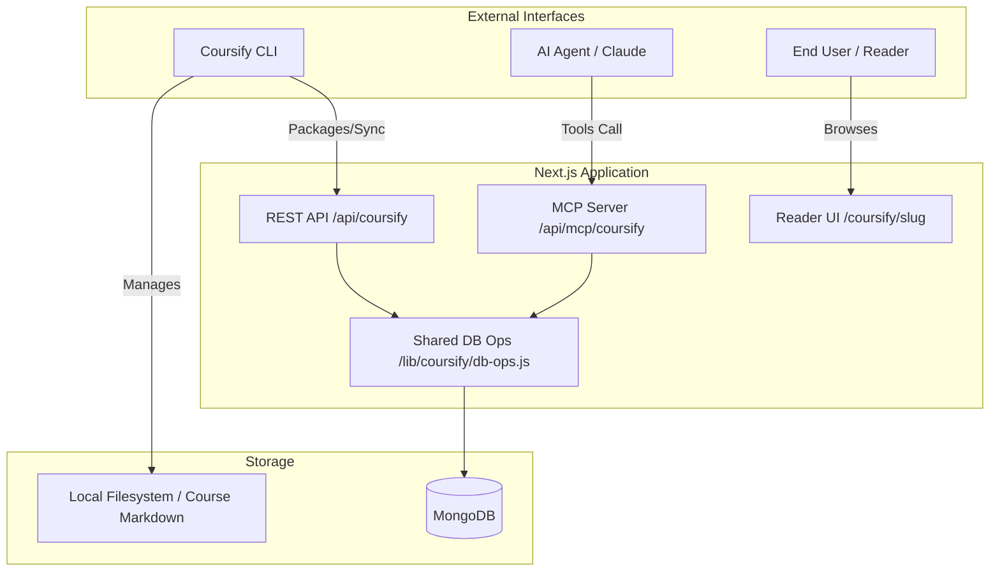

# Coursify Ecosystem — Technical Deep Dive Report

**Date**: May 12, 2026
**Project Status**: Active Development (V1.0.1 CLI, V1.0 MCP)
**Target Audience**: Developers, Instructional Designers, AI Agents

---

## 1. Executive Summary

Coursify is an **AI-first, local-first educational platform** designed to bridge the gap between AI-driven content generation and high-quality course delivery. It provides a tripartite ecosystem:

1.  **Next.js Web App**: A distraction-free reader and public search engine.
2.  **Coursify CLI**: A local-first authoring tool for developers who prefer Git-based workflows.
3.  **Coursify MCP**: A Model Context Protocol server that enables AI agents (like Claude) to plan, research, and author courses directly into the platform.

---

## 2. Technical Architecture

Coursify uses a unified data model across all interfaces, powered by MongoDB and shared business logic.



---

## 3. Coursify CLI (`@coursify/cli`)

The CLI is designed for **"Markdown-as-Code"** authoring. It allows creators to manage courses as local directories, benefiting from version control and offline editing.

### Key Capabilities:

- **Scaffolding**: `coursify init`, `init-module`, `init-section` create a standardized folder hierarchy.
- **Validation**: `coursify validate` checks for missing metadata, broken links, or empty sections.
- **Packaging**: `coursify package` bundles the entire directory into a single JSON schema for portable imports.
- **Publishing**: `coursify publish` synchronizes local changes with the remote server via a REST API.

### Local Structure:

```text
my-course/
├── course.yml          # Global metadata (title, objectives, tags)
├── modules/
│   └── module-1/
│       ├── module.yml  # Module metadata
│       └── sections/
│           └── section-1/
│               ├── section.yml  # Section metadata
│               └── content.md   # Markdown content with LaTeX/Mermaid support
```

---

## 4. Coursify MCP (Model Context Protocol)

The MCP server transforms AI assistants into **Instructional Designers**. It exposes 18 granular tools that allow agents to perform complex workflows.

### Core Toolsets:

| Category       | Tools                                  | Purpose                                       |
| :------------- | :------------------------------------- | :-------------------------------------------- |
| **Discovery**  | `list_courses`, `get_course`           | Context loading for existing content.         |
| **Research**   | `add_research_note`, `manage_research` | Storing sources, quotes, and findings.        |
| **Planning**   | `save_course_plan`, `analyze_outline`  | Defining audience, objectives, and structure. |
| **Authoring**  | `upsert_module`, `upsert_section`      | Generating content and quizzes.               |
| **Management** | `publish_course`, `delete_course`      | Lifecycle and cleanup.                        |

### The "Authoring Loop":

1.  **Research**: Agent searches the web and saves findings via `manage_research`.
2.  **Plan**: Agent proposes an outline; user approves; agent saves via `save_course_plan`.
3.  **Draft**: Agent generates modules and sections in batches using `upsert_section`.
4.  **Review**: Agent checks completeness via `get_course_progress`.

---

## 5. Data Models & Business Logic

Coursify's heart is `src/lib/coursify/db-ops.js`. This module ensures that regardless of whether a course is created via CLI or MCP, the same validation and normalization rules apply.

### Key Models (`src/models/`):

- **CoursifyCourse**: Stores metadata, planning fields (`targetAudience`, `learningObjectives`), and `agentNotes` (private state for AI agents).
- **CoursifyModule**: Grouping logic with status tracking (`idea` → `complete`).
- **CoursifySection**: The atomic unit of content. Supports `sectionType` (standard, lab, procedural), `blocks` (structured content), and `quiz` objects.

### Visual Features:

- **Mermaid Support**: All Markdown is rendered with Mermaid.js for interactive diagrams.
- **LaTeX**: Full support for mathematical notation.
- **AI Thumbnails**: `thumbnailGen.js` auto-generates stylized thumbnails using DALL-E 3 on course creation.

---

## 6. Gap Analysis & Roadmap

Based on the `Gap Analysis Report` and `Comprehensive Plan`, the following are the immediate focus areas:

### Identified Gaps:

- **Missing Tools**: `delete_module`, `get_module`, and `get_section` are currently missing from MCP.
- **Field Coverage**: `update_course` and `update_section` lack some planning fields (e.g., `authoringStatus`).
- **Admin UI**: While the reader is polished, a dedicated **Visual Admin Dashboard** is currently the highest priority missing feature.

### 2026 Roadmap:

- **Q2**: Build `/admin/coursify/` dashboard with a visual tree-editor for modules/sections.
- **Q3**: Enhance Reader UI with better progress tracking and offline sync.
- **Q4**: Release **Coursify Studio Agent** — a proactive AI that suggests improvements to existing courses based on user feedback.

---

## 7. Conclusion

The Coursify ecosystem is a robust foundation for the next generation of educational platforms. By treating course authoring as a **collaborative process between humans and AI**, and providing both **CLI and MCP** interfaces, it satisfies both traditional developers and modern AI-driven workflows.
